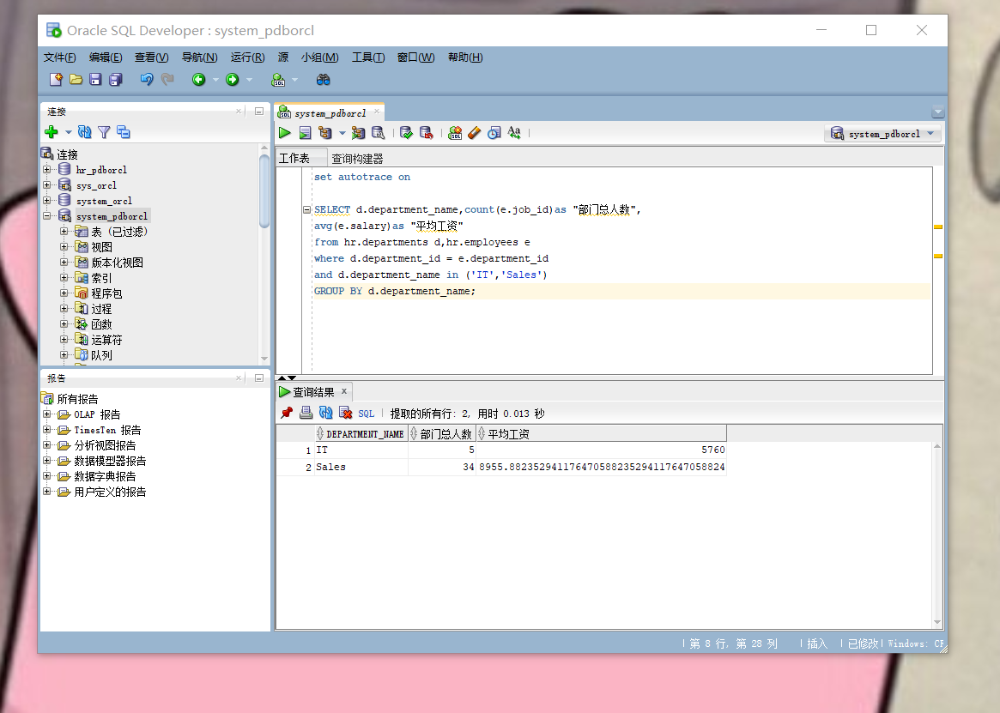
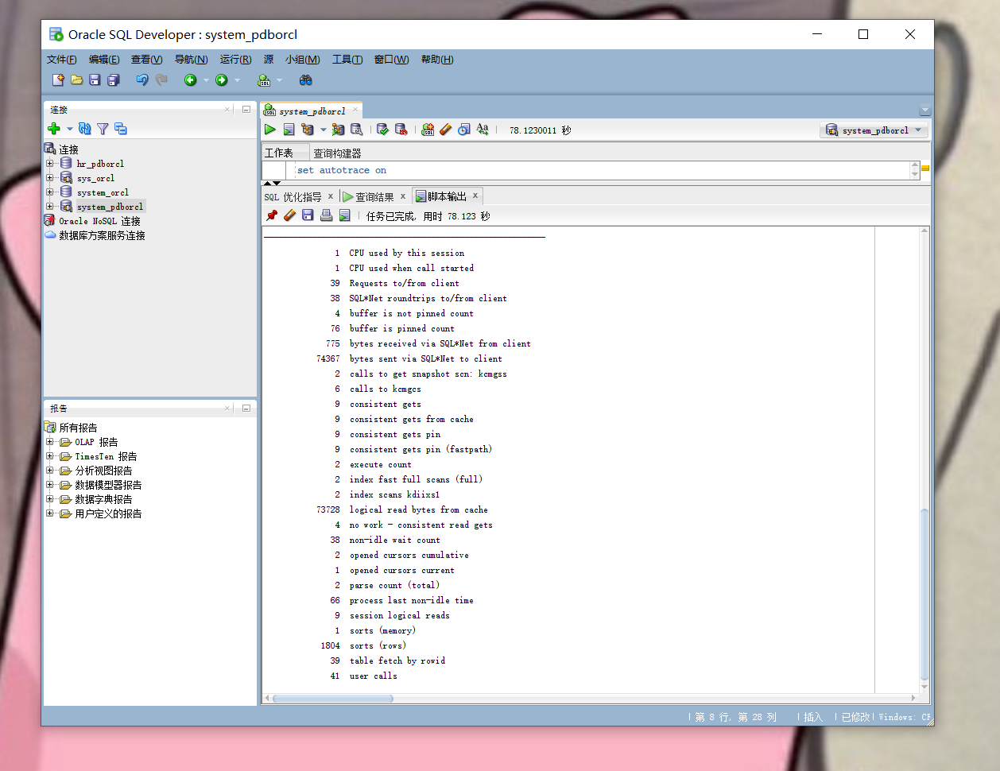
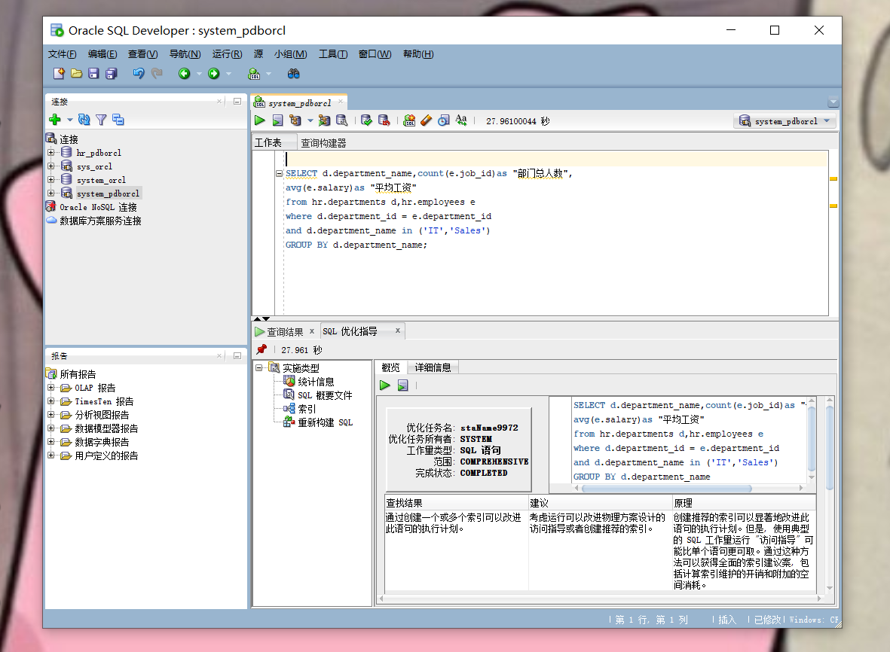
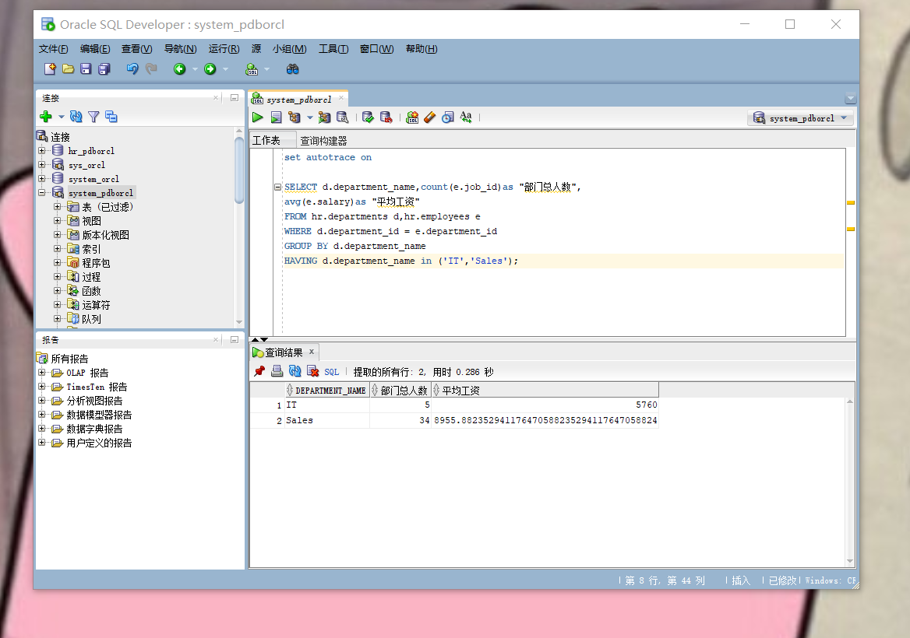
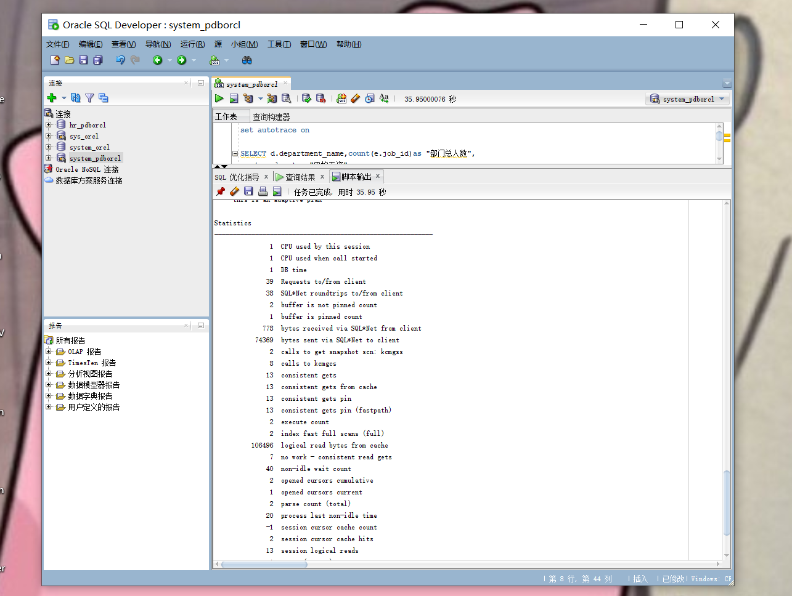
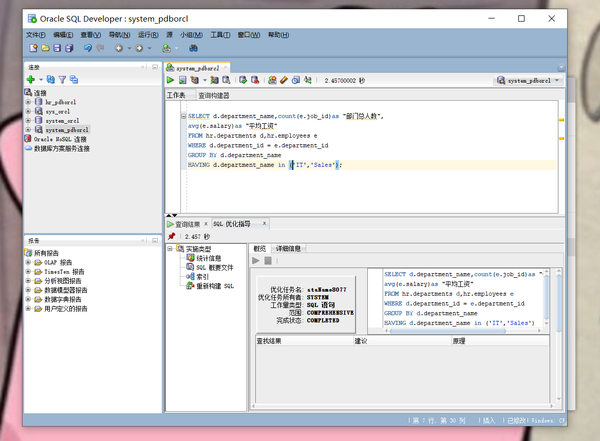
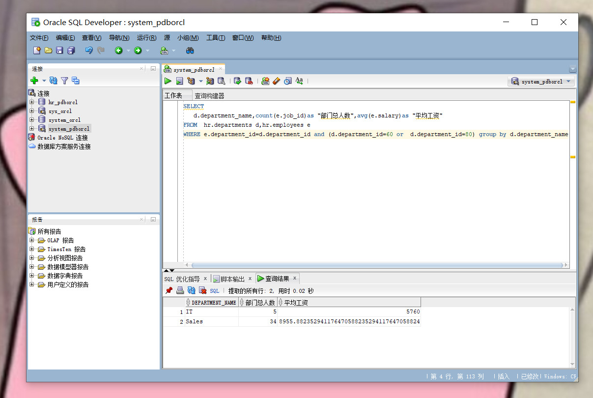
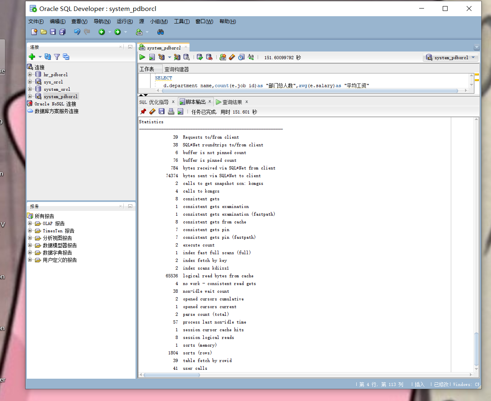
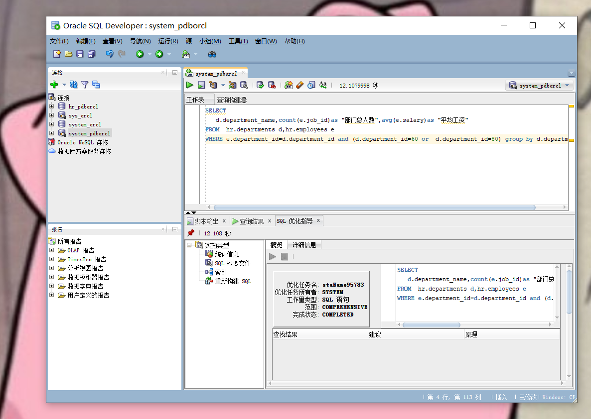

# 实验1
### 朱喜倩 201810414205 18软工2班
## 实验目的
分析SQL执行计划，执行SQL语句的优化指导。理解分析SQL语句的执行计划的重要作用。
## 实验内容
1.对Oracle12c中的HR人力资源管理系统中的表进行查询与分析。  
2.首先运行和分析教材中的样例：本训练任务目的是查询两个部门('IT'和'Sales')的部门总人数和平均工资，以下两个查询的结果是一样的。但效率不相同。  
3.设计自己的查询语句，并作相应的分析，查询语句不能太简单。
## 查询语句
### 查询1  
set autotrace on

SELECT d.department_name,count(e.job_id)as "部门总人数",
avg(e.salary)as "平均工资"
from hr.departments d,hr.employees e
where d.department_id = e.department_id
and d.department_name in ('IT','Sales')
GROUP BY d.department_name;    

查询结果：
    

执行计划：

优化指导:
 

### 分析1：
查询1的1索引范围扫描10行，提取的所行数为2，用时0.013秒。

### 查询2
set autotrace on

SELECT d.department_name,count(e.job_id)as "部门总人数",
avg(e.salary)as "平均工资"
FROM hr.departments d,hr.employees e
WHERE d.department_id = e.department_id
GROUP BY d.department_name
HAVING d.department_name in ('IT','Sales');

查询结果:

执行计划：

优化指导:
 

### 分析2：
本次查询的总代价大于第一次查询的代价，在查询的时候扫描了107行，查询1就没有，用时0.286秒，因此总体来讲查询1优于查询2。

### 查询3
SELECT
   d.department_name,count(e.job_id)as "部门总人数",avg(e.salary)as "平均工资"
FROM  hr.departments d,hr.employees e
WHERE e.department_id=d.department_id and (d.department_id=60 or  d.department_id=80) group by d.department_name

查询结果：

执行计划：

优化指导：

### 分析3：
查询3在查询的时候费时0.02秒，但是在执行计划的时候却花费了151.601秒，总体来讲，查询1和查询2都优于查询3。与此同时，系统工具未给出优化建议。

## 实验体会
通过本次实验，我了解到了oracle的查询语句，知道了如何去执行语句、优化指导以及执行进行。同时也知道了一去分析和比较执行计划，set autotrace off:是缺省值，将不生成autotrace报告；而set autotrace on:是输出查询结果，显示执行计划和统计信息；set autotrace on explain:是输出查询结果和显示执行计划。