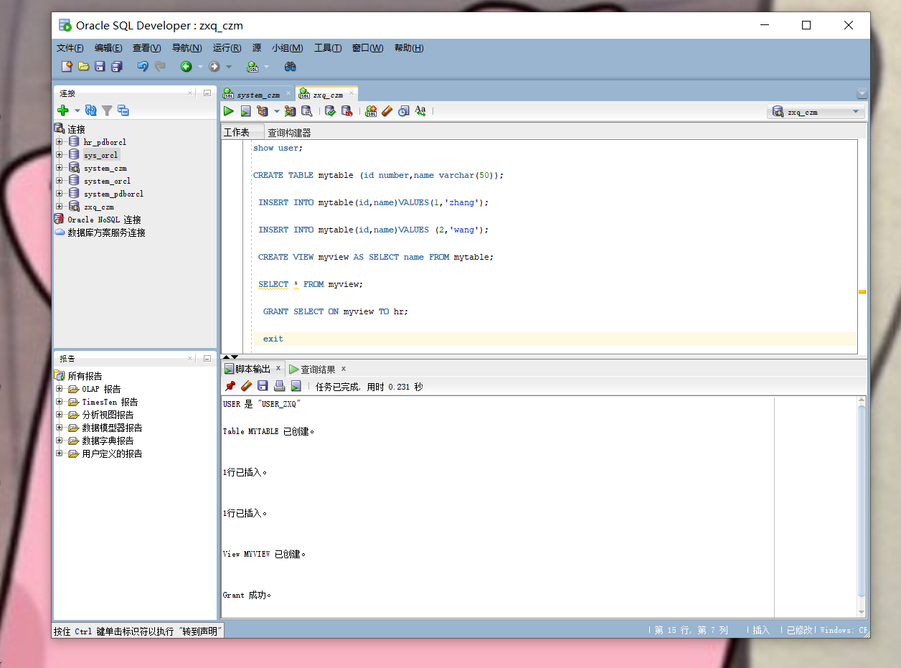

# 实验2
### 朱喜倩 201810414205 18软工2班
### github用户名 zhuxiqian
## 实验目的
掌握用户管理、角色管理、权根维护与分配的能力，掌握用户之间共享对象的操作技能。
## 实验内容
Oracle有一个开发者角色resource，可以创建表、过程、触发器等对象，但是不能创建视图。本训练要求：

1、在pdborcl插接式数据中创建一个新的本地角色con_res_view，该角色包含connect和resource角色，同时也包含CREATE VIEW权限，这样任何拥有con_res_view的用户就同时拥有这三种权限。

2、创建角色之后，再创建用户new_user，给用户分配表空间，设置限额为50M，授予con_res_view角色。 

3、最后测试：用新用户new_user连接数据库、创建表，插入数据，创建视图，查询表和视图的数据。

## 实验步骤
### 第1步
以system登录到pdborcl，创建角色con_res_view和用户new_user，并授权和分配空间：  
代码如下：

CREATE ROLE con_zxq;

GRANT connect,resource,CREATE VIEW TO con_zxq;

CREATE USER user_zxq IDENTIFIED BY 123 DEFAULT TABLESPACE users TEMPORARY TABLESPACE temp;

 ALTER USER user_zxq QUOTA 50M ON users;
 
GRANT zxq TO user_zxq;
 
 exit
  
实验截图：

### 第2步
新用户new_user连接到pdborcl，创建表mytable和视图myview，插入数据，最后将myview的SELECT对象权限授予hr用户。
创建代码：
show user;

CREATE TABLE mytable (id number,name varchar(50));

INSERT INTO mytable(id,name)VALUES(1,'zhang');
 
INSERT INTO mytable(id,name)VALUES (2,'wang');
 
CREATE VIEW myview AS SELECT name FROM mytable;

GRANT SELECT ON myview TO hr;

exit
 实验截图：
 

 查看表  SELECT * FROM myview;
 

### 第3步
 用户hr连接到pdborcl，查询new_user授予它的视图myview。   
SELECT * FROM user_zxq.myview;

实验截图：

### 测试同学用户表之间的只读共享
实验代码：
GRANT SELECT ON myview TO user_zyl;

SELECT * FROM user_zyl.zylview;

实验截图：

### 测试同学用户表之间的读写共享
实验代码：
GRANT INSERT ON mytable TO user_zyl;

INSERT INTO user_zyl.zyltable(id,name)VALUES (3,'zxq');
 
SELECT * FROM user_zyl.zylview;

实验截图：

### 数据库和表空间占用分析
当全班同学的实验都做完之后，数据库pdborcl中包含了每个同学的角色和用户。 所有同学的用户都使用表空间users存储表的数据。 表空间中存储了很多相同名称的表mytable和视图myview，但分别属性于不同的用户，不会引起混淆。 随着用户往表中插入数据，表空间的磁盘使用量会增加。

### 查看数据库的使用情况
以下样例查看表空间的数据库文件，以及每个文件的磁盘占用情况。  
SELECT tablespace_name,FILE_NAME,BYTES/1024/1024 MB,MAXBYTES/1024/1024 MAX_MB,autoextensible FROM dba_data_files  WHERE  tablespace_name='USERS';

实验截图:

SELECT a.tablespace_name "表空间名",Total/1024/1024 "大小MB",
 free/1024/1024 "剩余MB",( total - free )/1024/1024 "使用MB",
 Round(( total - free )/ total,4)* 100 "使用率%"
 from (SELECT tablespace_name,Sum(bytes)free
        FROM   dba_free_space group  BY tablespace_name)a,
       (SELECT tablespace_name,Sum(bytes)total FROM dba_data_files
        group  BY tablespace_name)b
 where  a.tablespace_name = b.tablespace_name;

 实验截图:

### 实验体会
通过本次实验，我学会并掌握了用户管理、角色管理，同时我还知道了如何去进行、权根维护与分配，在练习中还掌握了用户之间共享对象的操作技能。同时因为本次做实验的过程中pdborcl数据库关闭链接，所以做到第二步的时候还重新创建了一个新的链接，使用了czm数据库，自己创建连接的技术更加熟练了。