# 实验4
### 朱喜倩 201810414205 18软工2班
### github用户名 zhuxiqian
## 实验目的
了解Oracle表和视图的概念，学习使用SQL语句Create Table创建表，学习Select语句插入，修改，删除以及查询数据，学习使用SQL语句创建视图，学习部分存储过程和触发器的使用。
## 实验场景
假设有一个生产某个产品的单位，单位接受网上订单进行产品的销售。通过实验模拟这个单位的部分信息：员工表，部门表，订单表，订单详单表。
## 实验内容
录入数据：
要求至少有1万个订单，每个订单至少有4个详单。至少有两个部门，每个部门至少有1个员工，其中只有一个人没有领导，一个领导至少有一个下属，并且它的下属是另一个人的领导（比如A领导B，B领导C）。

序列的应用
插入ORDERS和ORDER_DETAILS 两个表的数据时，主键ORDERS.ORDER_ID, ORDER_DETAILS.ID的值必须通过序列SEQ_ORDER_ID和SEQ_ORDER_ID取得，不能手工输入一个数字。

触发器的应用：
维护ORDER_DETAILS的数据时（insert,delete,update）要同步更新ORDERS表订单应收货款ORDERS.Trade_Receivable的值。

查询数据：
1.查询某个员工的信息
2.递归查询某个员工及其所有下属，子下属员工。
3.查询订单表，并且包括订单的订单应收货款: Trade_Receivable= sum(订单详单表.ProductNum*订单详单表.ProductPrice)- Discount。
4.查询订单详表，要求显示订单的客户名称和客户电话，产品类型用汉字描述。
5.查询出所有空订单，即没有订单详单的订单。
6.查询部门表，同时显示部门的负责人姓名。
7.查询部门表，统计每个部门的销售总金额。

## 操作步骤
### 1、授权
ALTER USER user_zxq QUOTA UNLIMITED ON USERS;
ALTER USER user_zxq QUOTA UNLIMITED ON USERS02;
ALTER USER user_zxq ACCOUNT UNLOCK;

GRANT "CONNECT" TO user_zxq WITH ADMIN OPTION;
GRANT "RESOURCE" TO user_zxq WITH ADMIN OPTION;
ALTER USER  user_zxq DEFAULT ROLE "CONNECT","RESOURCE";

GRANT CREATE VIEW TO user_zxq WITH ADMIN OPTION;
GRANT CREATE SESSION TO   user_zxq;
GRANT CREATE TABLE TO user_zxq;
GRANT CREATE TABLESPACE TO  user_zxq;
GRANT CREATE VIEW TO  user_zxq;
实验截图:
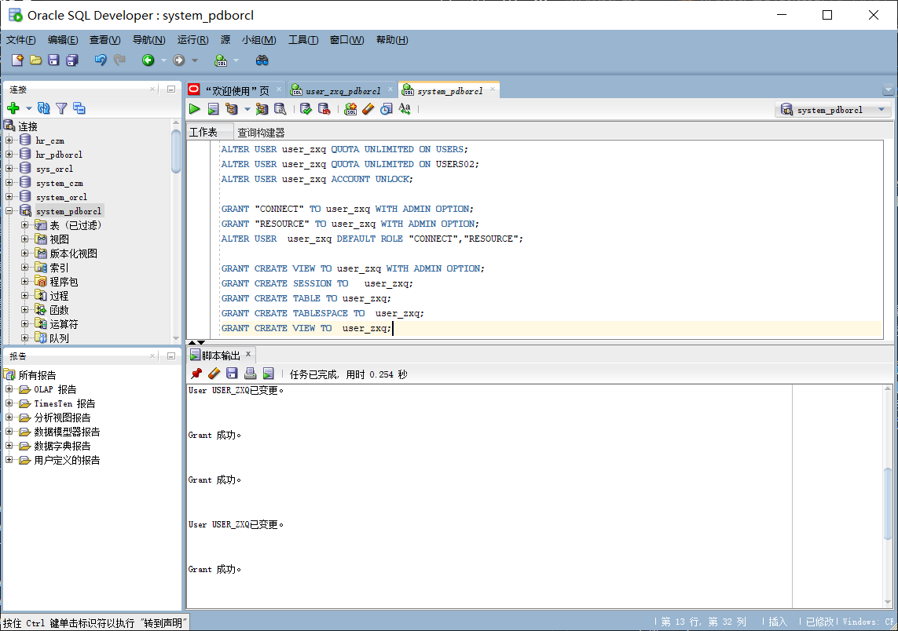

### 2、增加一个表空间 ZXQ
Create Tablespace ZXQ
datafile
'/home/oracle/app/oracle/oradata/orcl/pdborcl/ZXQ_user1.dbf'
  SIZE 100M AUTOEXTEND ON NEXT 256M MAXSIZE UNLIMITED,
'/home/oracle/app/oracle/oradata/orcl/pdborcl/ZXQ_user2.dbf'
  SIZE 100M AUTOEXTEND ON NEXT 256M MAXSIZE UNLIMITED
EXTENT MANAGEMENT LOCAL SEGMENT SPACE MANAGEMENT AUTO;
实验截图:

### 3、创建用户STUDY_ZXQ
CREATE USER STUDY_ZXQ IDENTIFIED BY 123
DEFAULT TABLESPACE "USERS"
TEMPORARY TABLESPACE "TEMP";
实验截图:

### 4、赋予ml视图权限
-- QUOTAS
ALTER USER STUDY_ZXQ QUOTA UNLIMITED ON USERS;
ALTER USER STUDY_ZXQ QUOTA UNLIMITED ON USERS02;
ALTER USER STUDY_ZXQ ACCOUNT UNLOCK;

-- ROLES
GRANT "CONNECT" TO STUDY_ZXQ WITH ADMIN OPTION;
GRANT "RESOURCE" TO STUDY_ZXQ WITH ADMIN OPTION;
ALTER USER STUDY_ZXQ DEFAULT ROLE "CONNECT","RESOURCE";

-- SYSTEM PRIVILEGES
GRANT CREATE VIEW TO STUDY_ZXQ WITH ADMIN OPTION;
实验截图:
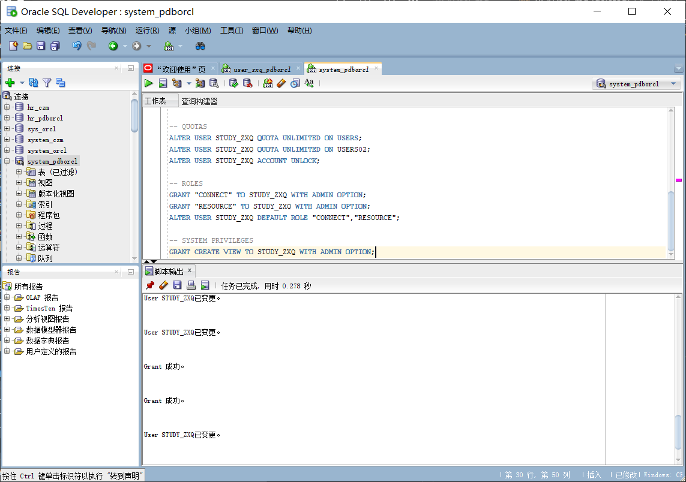

### 5、删除表和序列；删除表的同时会一起删除主外键、触发器、程序包。
declare
      num   number;
begin
      select count(1) into num from user_tables where TABLE_NAME = 'DEPARTMENTS';
      if   num=1   then
          execute immediate 'drop table DEPARTMENTS cascade constraints PURGE';
      end   if;

      select count(1) into num from user_tables where TABLE_NAME = 'EMPLOYEES';
      if   num=1   then
          execute immediate 'drop table EMPLOYEES cascade constraints PURGE';
      end   if;

      select count(1) into num from user_tables where TABLE_NAME = 'ORDER_ID_TEMP';
      if   num=1   then
          execute immediate 'drop table ORDER_ID_TEMP cascade constraints PURGE';
      end   if;

      select count(1) into num from user_tables where TABLE_NAME = 'ORDER_DETAILS';
      if   num=1   then
          execute immediate 'drop table ORDER_DETAILS cascade constraints PURGE';
      end   if;

      select count(1) into num from user_tables where TABLE_NAME = 'ORDERS';
      if   num=1   then
          execute immediate 'drop table ORDERS cascade constraints PURGE';
      end   if;

      select count(1) into num from user_tables where TABLE_NAME = 'PRODUCTS';
      if   num=1   then
          execute immediate 'drop table PRODUCTS cascade constraints PURGE';
      end   if;

      select count(1) into num from user_sequences where SEQUENCE_NAME = 'SEQ_ORDER_DETAILS_ID';
      if   num=1   then
          execute immediate 'drop  SEQUENCE SEQ_ORDER_DETAILS_ID';
      end   if;

      select count(1) into num from user_sequences where SEQUENCE_NAME = 'SEQ_ORDER_ID';
      if   num=1   then
          execute immediate 'drop  SEQUENCE SEQ_ORDER_ID';
      end   if;
      select count(1) into num from user_views where VIEW_NAME = 'VIEW_ORDER_DETAILS';
      if   num=1   then
          execute immediate 'drop VIEW VIEW_ORDER_DETAILS';
      end   if;

      SELECT count(object_name)  into num FROM user_objects_ae WHERE object_type = 'PACKAGE' and OBJECT_NAME='MYPACK';
      if   num=1   then
          execute immediate 'DROP PACKAGE MYPACK';
      end   if;
end;
实验截图:
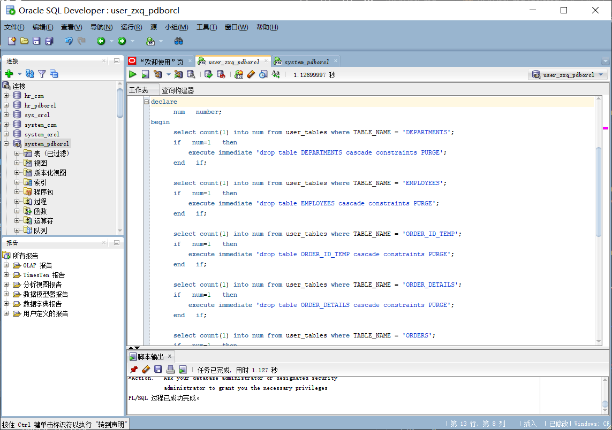

### 6、DDL for Table DEPARTMENTS
CREATE TABLE DEPARTMENTS
(
  DEPARTMENT_ID NUMBER(6, 0) NOT NULL
, DEPARTMENT_NAME VARCHAR2(40 BYTE) NOT NULL
, CONSTRAINT DEPARTMENTS_PK PRIMARY KEY
  (
    DEPARTMENT_ID
  )
  USING INDEX
  (
      CREATE UNIQUE INDEX DEPARTMENTS_PK ON DEPARTMENTS (DEPARTMENT_ID ASC)
      NOLOGGING
      TABLESPACE USERS
      PCTFREE 10
      INITRANS 2
      STORAGE
      (
        INITIAL 65536
        NEXT 1048576
        MINEXTENTS 1
        MAXEXTENTS UNLIMITED
        BUFFER_POOL DEFAULT
      )
      NOPARALLEL
  )
  ENABLE
)
NOLOGGING
TABLESPACE USERS
PCTFREE 10
INITRANS 1
STORAGE
(
  INITIAL 65536
  NEXT 1048576
  MINEXTENTS 1
  MAXEXTENTS UNLIMITED
  BUFFER_POOL DEFAULT
)
NOCOMPRESS NO INMEMORY NOPARALLEL;

实验截图:
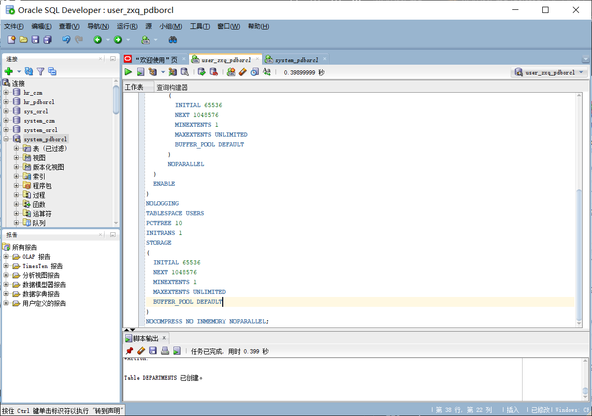

### 6、DDL for Table EMPLOYEES
CREATE TABLE EMPLOYEES
(
  EMPLOYEE_ID NUMBER(6, 0) NOT NULL
, NAME VARCHAR2(40 BYTE) NOT NULL
, EMAIL VARCHAR2(40 BYTE)
, PHONE_NUMBER VARCHAR2(40 BYTE)
, HIRE_DATE DATE NOT NULL
, SALARY NUMBER(8, 2)
, MANAGER_ID NUMBER(6, 0)
, DEPARTMENT_ID NUMBER(6, 0)
, PHOTO BLOB
, CONSTRAINT EMPLOYEES_PK PRIMARY KEY
  (
    EMPLOYEE_ID
  )
  USING INDEX
  (
      CREATE UNIQUE INDEX EMPLOYEES_PK ON EMPLOYEES (EMPLOYEE_ID ASC)
      NOLOGGING
      TABLESPACE USERS
      PCTFREE 10
      INITRANS 2
      STORAGE
      (
        INITIAL 65536
        NEXT 1048576
        MINEXTENTS 1
        MAXEXTENTS UNLIMITED
        BUFFER_POOL DEFAULT
      )
      NOPARALLEL
  )
  ENABLE
)
NOLOGGING
TABLESPACE USERS
PCTFREE 10
INITRANS 1
STORAGE
(
  INITIAL 65536
  NEXT 1048576
  MINEXTENTS 1
  MAXEXTENTS UNLIMITED
  BUFFER_POOL DEFAULT
)
NOCOMPRESS
NO INMEMORY
NOPARALLEL
LOB (PHOTO) STORE AS SYS_LOB0000092017C00009$$
(
  ENABLE STORAGE IN ROW
  CHUNK 8192
  NOCACHE
  NOLOGGING
  TABLESPACE USERS
  STORAGE
  (
    INITIAL 106496
    NEXT 1048576
    MINEXTENTS 1
    MAXEXTENTS UNLIMITED
    BUFFER_POOL DEFAULT
  )
);

CREATE INDEX EMPLOYEES_INDEX1_NAME ON EMPLOYEES (NAME ASC)
NOLOGGING
TABLESPACE USERS
PCTFREE 10
INITRANS 2
STORAGE
(
  INITIAL 65536
  NEXT 1048576
  MINEXTENTS 1
  MAXEXTENTS UNLIMITED
  BUFFER_POOL DEFAULT
)
NOPARALLEL;

ALTER TABLE EMPLOYEES
ADD CONSTRAINT EMPLOYEES_FK1 FOREIGN KEY
(
  DEPARTMENT_ID
)
REFERENCES DEPARTMENTS
(
  DEPARTMENT_ID
)
ENABLE;

ALTER TABLE EMPLOYEES
ADD CONSTRAINT EMPLOYEES_FK2 FOREIGN KEY
(
  MANAGER_ID
)
REFERENCES EMPLOYEES
(
  EMPLOYEE_ID
)
ON DELETE SET NULL ENABLE;

ALTER TABLE EMPLOYEES
ADD CONSTRAINT EMPLOYEES_CHK1 CHECK
(SALARY>0)
ENABLE;

ALTER TABLE EMPLOYEES
ADD CONSTRAINT EMPLOYEES_CHK2 CHECK
(EMPLOYEE_ID<>MANAGER_ID)
ENABLE;

ALTER TABLE EMPLOYEES
ADD CONSTRAINT EMPLOYEES_EMPLOYEE_MANAGER_ID CHECK
(MANAGER_ID<>EMPLOYEE_ID)
ENABLE;

ALTER TABLE EMPLOYEES
ADD CONSTRAINT EMPLOYEES_SALARY CHECK
(SALARY>0)
ENABLE;

CREATE TABLE PRODUCTS
(
  PRODUCT_NAME VARCHAR2(40 BYTE) NOT NULL
, PRODUCT_TYPE VARCHAR2(40 BYTE) NOT NULL
, CONSTRAINT PRODUCTS_PK PRIMARY KEY
  (
    PRODUCT_NAME
  )
  ENABLE
)
LOGGING
TABLESPACE "USERS"
PCTFREE 10
INITRANS 1
STORAGE
(
  INITIAL 65536
  NEXT 1048576
  MINEXTENTS 1
  MAXEXTENTS 2147483645
  BUFFER_POOL DEFAULT
);

ALTER TABLE PRODUCTS
ADD CONSTRAINT PRODUCTS_CHK1 CHECK
(PRODUCT_TYPE IN ('耗材', '手机', '电脑'))
ENABLE;
实验截图:
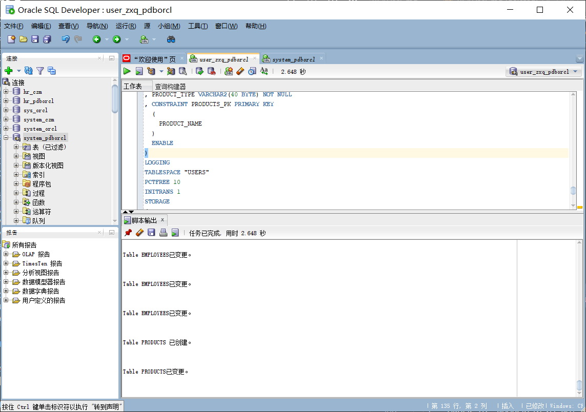

### 7、DDL for Table ORDER_ID_TEMP
CREATE GLOBAL TEMPORARY TABLE "ORDER_ID_TEMP"
   (	"ORDER_ID" NUMBER(10,0) NOT NULL ENABLE,
	 CONSTRAINT "ORDER_ID_TEMP_PK" PRIMARY KEY ("ORDER_ID") ENABLE
   ) ON COMMIT DELETE ROWS ;

   COMMENT ON TABLE "ORDER_ID_TEMP"  IS '用于触发器存储临时ORDER_ID';
实验截图:
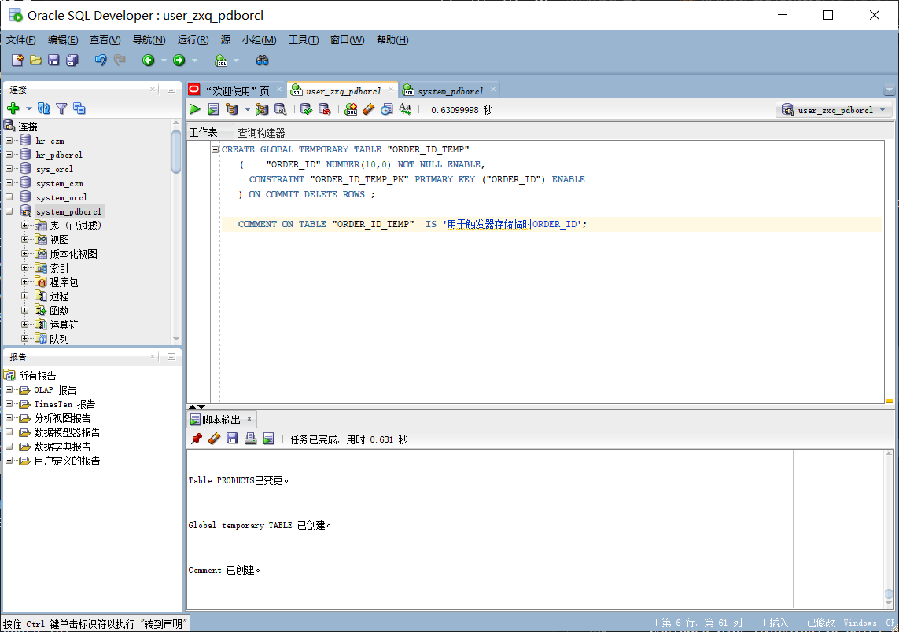

### 8、DDL for Table ORDERS
CREATE TABLE ORDERS
(
  ORDER_ID NUMBER(10, 0) NOT NULL
, CUSTOMER_NAME VARCHAR2(40 BYTE) NOT NULL
, CUSTOMER_TEL VARCHAR2(40 BYTE) NOT NULL
, ORDER_DATE DATE NOT NULL
, EMPLOYEE_ID NUMBER(6, 0) NOT NULL
, DISCOUNT NUMBER(8, 2) DEFAULT 0
, TRADE_RECEIVABLE NUMBER(8, 2) DEFAULT 0
)
TABLESPACE USERS
PCTFREE 10
INITRANS 1
STORAGE
(
  BUFFER_POOL DEFAULT
)
NOCOMPRESS
NOPARALLEL
PARTITION BY RANGE (ORDER_DATE)
(
  PARTITION PARTITION_BEFORE_2016 VALUES LESS THAN (TO_DATE(' 2016-01-01 00:00:00', 'SYYYY-MM-DD HH24:MI:SS', 'NLS_CALENDAR=GREGORIAN'))
  NOLOGGING
  TABLESPACE USERS
  PCTFREE 10
  INITRANS 1
  STORAGE
  (
    INITIAL 8388608
    NEXT 1048576
    MINEXTENTS 1
    MAXEXTENTS UNLIMITED
    BUFFER_POOL DEFAULT
  )
  NOCOMPRESS NO INMEMORY
, PARTITION PARTITION_BEFORE_2017 VALUES LESS THAN (TO_DATE(' 2017-01-01 00:00:00', 'SYYYY-MM-DD HH24:MI:SS', 'NLS_CALENDAR=GREGORIAN'))
  NOLOGGING
  TABLESPACE USERS02
  PCTFREE 10
  INITRANS 1
  STORAGE
  (
    INITIAL 8388608
    NEXT 1048576
    MINEXTENTS 1
    MAXEXTENTS UNLIMITED
    BUFFER_POOL DEFAULT
  )
  NOCOMPRESS NO INMEMORY
);
实验截图:
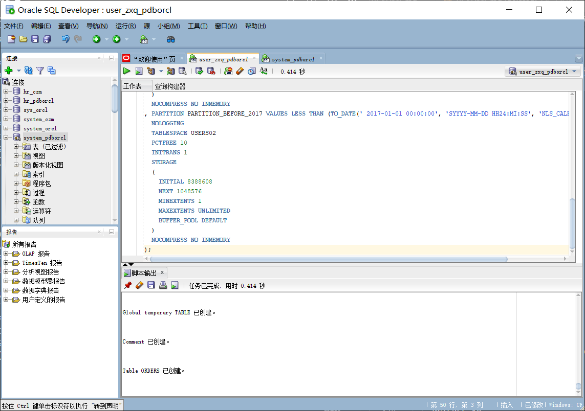

### 9、创建本地分区索引ORDERS_INDEX_DATE：
CREATE INDEX ORDERS_INDEX_DATE ON ORDERS (ORDER_DATE ASC)
LOCAL
(
  PARTITION PARTITION_BEFORE_2016
    TABLESPACE USERS
    PCTFREE 10
    INITRANS 2
    STORAGE
    (
      INITIAL 8388608
      NEXT 1048576
      MINEXTENTS 1
      MAXEXTENTS UNLIMITED
      BUFFER_POOL DEFAULT
    )
    NOCOMPRESS
, PARTITION PARTITION_BEFORE_2017
    TABLESPACE USERS02
    PCTFREE 10
    INITRANS 2
    STORAGE
    (
      INITIAL 8388608
      NEXT 1048576
      MINEXTENTS 1
      MAXEXTENTS UNLIMITED
      BUFFER_POOL DEFAULT
    )
    NOCOMPRESS
)
STORAGE
(
  BUFFER_POOL DEFAULT
)
NOPARALLEL;

CREATE INDEX ORDERS_INDEX_CUSTOMER_NAME ON ORDERS (CUSTOMER_NAME ASC)
NOLOGGING
TABLESPACE USERS
PCTFREE 10
INITRANS 2
STORAGE
(
  INITIAL 65536
  NEXT 1048576
  MINEXTENTS 1
  MAXEXTENTS UNLIMITED
  BUFFER_POOL DEFAULT
)
NOPARALLEL;

CREATE UNIQUE INDEX ORDERS_PK ON ORDERS (ORDER_ID ASC)
GLOBAL PARTITION BY HASH (ORDER_ID)
(
  PARTITION INDEX_PARTITION1 TABLESPACE USERS
    NOCOMPRESS
, PARTITION INDEX_PARTITION2 TABLESPACE USERS02
    NOCOMPRESS
)
NOLOGGING
TABLESPACE USERS
PCTFREE 10
INITRANS 2
STORAGE
(
  INITIAL 65536
  NEXT 1048576
  MINEXTENTS 1
  MAXEXTENTS UNLIMITED
  BUFFER_POOL DEFAULT
)
NOPARALLEL;

ALTER TABLE ORDERS
ADD CONSTRAINT ORDERS_PK PRIMARY KEY
(
  ORDER_ID
)
USING INDEX ORDERS_PK
ENABLE;

ALTER TABLE ORDERS
ADD CONSTRAINT ORDERS_FK1 FOREIGN KEY
(
  EMPLOYEE_ID
)
REFERENCES EMPLOYEES
(
  EMPLOYEE_ID
)
ENABLE;

CREATE TABLE ORDER_DETAILS
(
  ID NUMBER(10, 0) NOT NULL
, ORDER_ID NUMBER(10, 0) NOT NULL
, PRODUCT_NAME VARCHAR2(40 BYTE) NOT NULL
, PRODUCT_NUM NUMBER(8, 2) NOT NULL
, PRODUCT_PRICE NUMBER(8, 2) NOT NULL
, CONSTRAINT ORDER_DETAILS_FK1 FOREIGN KEY
  (
  ORDER_ID
  )
  REFERENCES ORDERS
  (
  ORDER_ID
  )
  ENABLE
)
TABLESPACE USERS
PCTFREE 10
INITRANS 1
STORAGE
(
  BUFFER_POOL DEFAULT
)
NOCOMPRESS
NOPARALLEL
PARTITION BY REFERENCE (ORDER_DETAILS_FK1)
(
  PARTITION PARTITION_BEFORE_2016
  NOLOGGING
  TABLESPACE USERS --必须指定表空间，否则会将分区存储在用户的默认表空间中
  PCTFREE 10
  INITRANS 1
  STORAGE
  (
    INITIAL 8388608
    NEXT 1048576
    MINEXTENTS 1
    MAXEXTENTS UNLIMITED
    BUFFER_POOL DEFAULT
  )
  NOCOMPRESS NO INMEMORY,
  PARTITION PARTITION_BEFORE_2017
  NOLOGGING
  TABLESPACE USERS02
  PCTFREE 10
  INITRANS 1
  STORAGE
  (
    INITIAL 8388608
    NEXT 1048576
    MINEXTENTS 1
    MAXEXTENTS UNLIMITED
    BUFFER_POOL DEFAULT
  )
  NOCOMPRESS NO INMEMORY
)
;

CREATE UNIQUE INDEX ORDER_DETAILS_PK ON ORDER_DETAILS (ID ASC)
NOLOGGING
TABLESPACE USERS
PCTFREE 10
INITRANS 2
STORAGE
(
  INITIAL 65536
  NEXT 1048576
  MINEXTENTS 1
  MAXEXTENTS UNLIMITED
  BUFFER_POOL DEFAULT
)
NOPARALLEL;

ALTER TABLE ORDER_DETAILS
ADD CONSTRAINT ORDER_DETAILS_PK PRIMARY KEY
(
  ID
)
USING INDEX ORDER_DETAILS_PK
ENABLE;
实验截图:
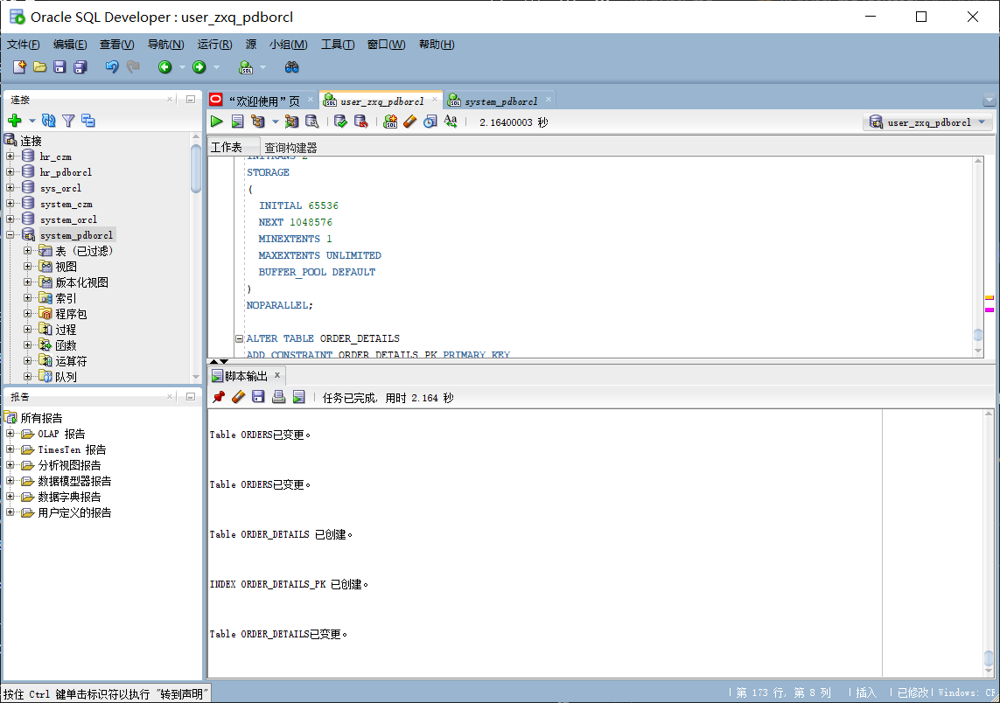

### 10、创建索引
CREATE INDEX ORDER_DETAILS_ORDER_ID ON ORDER_DETAILS (ORDER_ID)
GLOBAL PARTITION BY HASH (ORDER_ID)
(
  PARTITION INDEX_PARTITION1 TABLESPACE USERS
    NOCOMPRESS
, PARTITION INDEX_PARTITION2 TABLESPACE USERS02
    NOCOMPRESS
);

ALTER TABLE ORDER_DETAILS
ADD CONSTRAINT ORDER_DETAILS_PRODUCT_NUM CHECK
(Product_Num>0)
ENABLE;
实验截图:
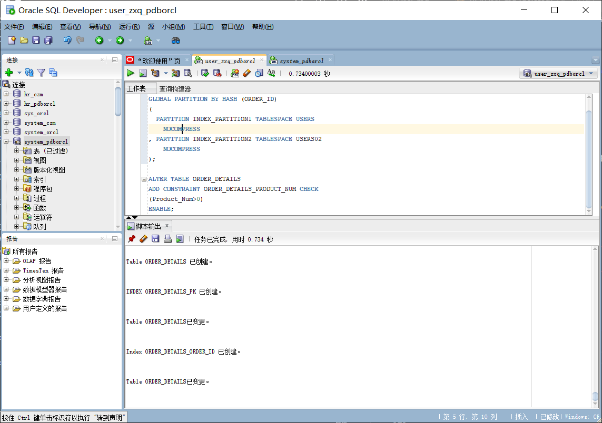

### 11、创建3个触发器
CREATE OR REPLACE EDITIONABLE TRIGGER "ORDERS_TRIG_ROW_LEVEL"
BEFORE INSERT OR UPDATE OF DISCOUNT ON "ORDERS"
FOR EACH ROW --行级触发器
declare
  m number(8,2);
BEGIN
  if inserting then
       :new.TRADE_RECEIVABLE := - :new.discount;
  else
      select sum(PRODUCT_NUM*PRODUCT_PRICE) into m from ORDER_DETAILS where ORDER_ID=:old.ORDER_ID;
      if m is null then
        m:=0;
      end if;
      :new.TRADE_RECEIVABLE := m - :new.discount;
  end if;
END;
实验截图:
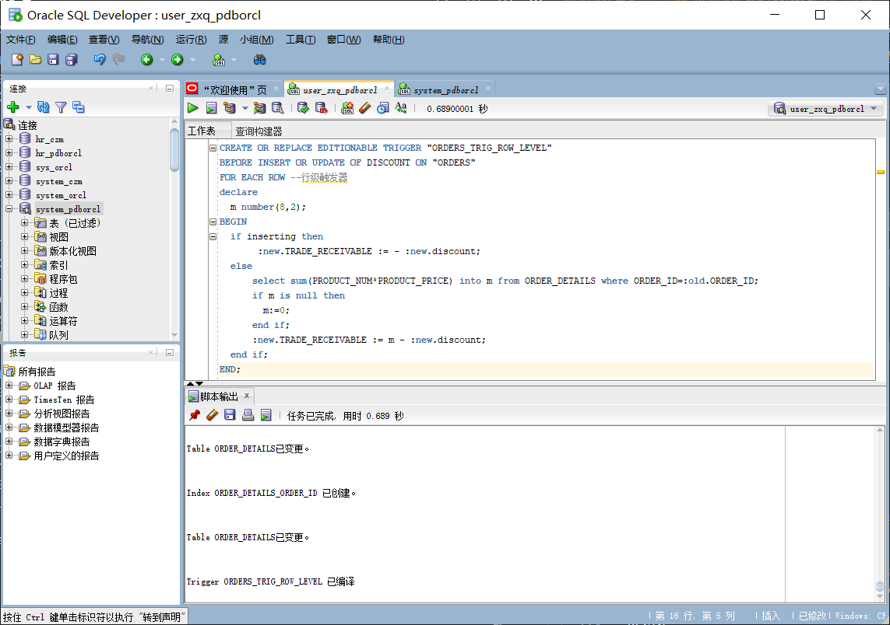

### 12、插入数据
INSERT INTO DEPARTMENTS(DEPARTMENT_ID,DEPARTMENT_NAME) values (1,'总经办');
INSERT INTO EMPLOYEES(EMPLOYEE_ID,NAME,EMAIL,PHONE_NUMBER,HIRE_DATE,SALARY,MANAGER_ID,DEPARTMENT_ID)
  VALUES (1,'李董事长',NULL,NULL,to_date('2010-1-1','yyyy-mm-dd'),50000,NULL,1);

INSERT INTO DEPARTMENTS(DEPARTMENT_ID,DEPARTMENT_NAME) values (11,'销售部1');
INSERT INTO EMPLOYEES(EMPLOYEE_ID,NAME,EMAIL,PHONE_NUMBER,HIRE_DATE,SALARY,MANAGER_ID,DEPARTMENT_ID)
  VALUES (11,'张总',NULL,NULL,to_date('2010-1-1','yyyy-mm-dd'),50000,1,1);
INSERT INTO EMPLOYEES(EMPLOYEE_ID,NAME,EMAIL,PHONE_NUMBER,HIRE_DATE,SALARY,MANAGER_ID,DEPARTMENT_ID)
  VALUES (111,'吴经理',NULL,NULL,to_date('2010-1-1','yyyy-mm-dd'),50000,11,11);
INSERT INTO EMPLOYEES(EMPLOYEE_ID,NAME,EMAIL,PHONE_NUMBER,HIRE_DATE,SALARY,MANAGER_ID,DEPARTMENT_ID)
  VALUES (112,'白经理',NULL,NULL,to_date('2010-1-1','yyyy-mm-dd'),50000,11,11);

INSERT INTO DEPARTMENTS(DEPARTMENT_ID,DEPARTMENT_NAME) values (12,'销售部2');
INSERT INTO EMPLOYEES(EMPLOYEE_ID,NAME,EMAIL,PHONE_NUMBER,HIRE_DATE,SALARY,MANAGER_ID,DEPARTMENT_ID)
  VALUES (12,'王总',NULL,NULL,to_date('2010-1-1','yyyy-mm-dd'),50000,1,1);
INSERT INTO EMPLOYEES(EMPLOYEE_ID,NAME,EMAIL,PHONE_NUMBER,HIRE_DATE,SALARY,MANAGER_ID,DEPARTMENT_ID)
  VALUES (121,'赵经理',NULL,NULL,to_date('2010-1-1','yyyy-mm-dd'),50000,12,12);
INSERT INTO EMPLOYEES(EMPLOYEE_ID,NAME,EMAIL,PHONE_NUMBER,HIRE_DATE,SALARY,MANAGER_ID,DEPARTMENT_ID)
  VALUES (122,'刘经理',NULL,NULL,to_date('2010-1-1','yyyy-mm-dd'),50000,12,12);

insert into products (product_name,product_type) values ('computer1','电脑');
insert into products (product_name,product_type) values ('computer2','电脑');
insert into products (product_name,product_type) values ('computer3','电脑');

insert into products (product_name,product_type) values ('phone1','手机');
insert into products (product_name,product_type) values ('phone2','手机');
insert into products (product_name,product_type) values ('phone3','手机');

insert into products (product_name,product_type) values ('paper1','耗材');
insert into products (product_name,product_type) values ('paper2','耗材');
insert into products (product_name,product_type) values ('paper3','耗材');
实验截图:
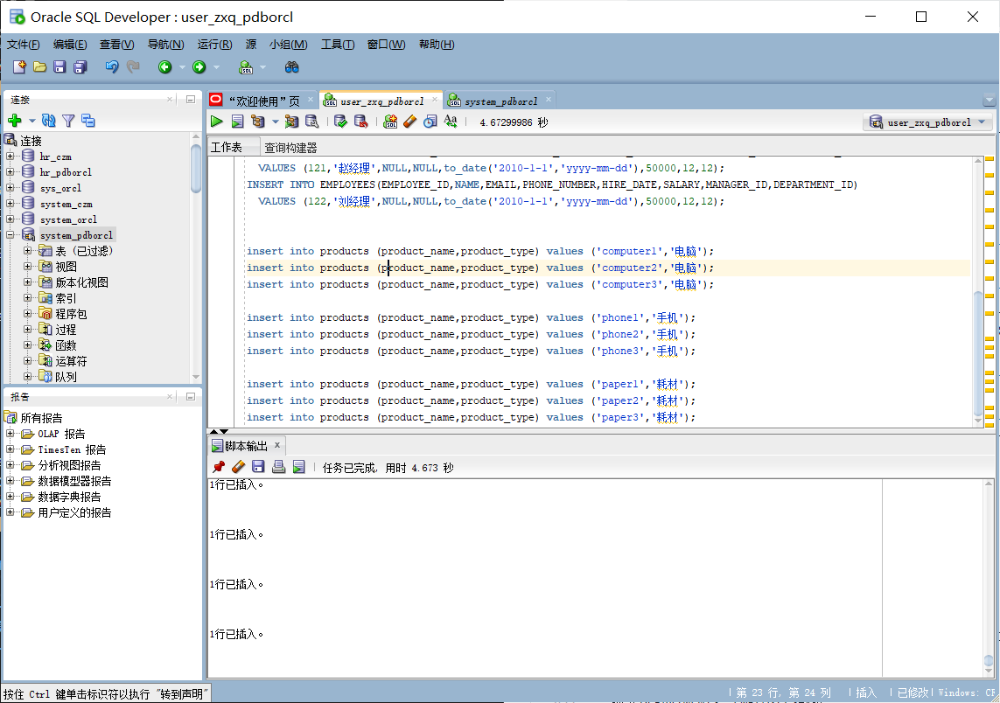

### 13、批量插入订单数据，注意ORDERS.TRADE_RECEIVABLE（订单应收款）的自动计算,注意插入数据的速度**
**--2千万条记录，插入的时间是：18100秒（约5小时）**
declare
  dt date;
  m number(8,2);
  V_EMPLOYEE_ID NUMBER(6);
  v_order_id number(10);
  v_name varchar2(100);
  v_tel varchar2(100);
  v number(10,2);

begin
  for i in 1..10000
  loop
    if i mod 2 =0 then
      dt:=to_date('2015-3-2','yyyy-mm-dd')+(i mod 60);
    else
      dt:=to_date('2016-3-2','yyyy-mm-dd')+(i mod 60);
    end if;
    V_EMPLOYEE_ID:=CASE I MOD 6 WHEN 0 THEN 11 WHEN 1 THEN 111 WHEN 2 THEN 112
                                WHEN 3 THEN 12 WHEN 4 THEN 121 ELSE 122 END;
    --插入订单
    v_order_id:=SEQ_ORDER_ID.nextval; --应该将SEQ_ORDER_ID.nextval保存到变量中。
    v_name := 'aa'|| 'aa';
    v_name := 'zhang' || i;
    v_tel := '139888883' || i;
    insert /*+append*/ into ORDERS (ORDER_ID,CUSTOMER_NAME,CUSTOMER_TEL,ORDER_DATE,EMPLOYEE_ID,DISCOUNT)
      values (v_order_id,v_name,v_tel,dt,V_EMPLOYEE_ID,dbms_random.value(100,0));
    --插入订单y一个订单包括3个产品
    v:=dbms_random.value(10000,4000);
    v_name:='computer'|| (i mod 3 + 1);
    insert /*+append*/ into ORDER_DETAILS(ID,ORDER_ID,PRODUCT_NAME,PRODUCT_NUM,PRODUCT_PRICE)
      values (SEQ_ORDER_DETAILS_ID.NEXTVAL,v_order_id,v_name,2,v);
    v:=dbms_random.value(1000,50);
    v_name:='paper'|| (i mod 3 + 1);
    insert /*+append*/ into ORDER_DETAILS(ID,ORDER_ID,PRODUCT_NAME,PRODUCT_NUM,PRODUCT_PRICE)
      values (SEQ_ORDER_DETAILS_ID.NEXTVAL,v_order_id,v_name,3,v);
    v:=dbms_random.value(9000,2000);
    v_name:='phone'|| (i mod 3 + 1);
    insert /*+append*/ into ORDER_DETAILS(ID,ORDER_ID,PRODUCT_NAME,PRODUCT_NUM,PRODUCT_PRICE)
      values (SEQ_ORDER_DETAILS_ID.NEXTVAL,v_order_id,v_name,1,v);
    --在触发器关闭的情况下，需要手工计算每个订单的应收金额：
    select sum(PRODUCT_NUM*PRODUCT_PRICE) into m from ORDER_DETAILS where ORDER_ID=v_order_id;
    if m is null then
     m:=0;
    end if;
    UPDATE ORDERS SET TRADE_RECEIVABLE = m - discount WHERE ORDER_ID=v_order_id;
    IF I MOD 1000 =0 THEN
      commit; --每次提交会加快插入数据的速度
    END IF;
  end loop;
  --统计用户的所有表，所需时间很长：2千万行数据，需要1600秒，该语句可选
  --dbms_stats.gather_schema_stats(User,estimate_percent=>100,cascade=> TRUE); --estimate_percent采样行的百分比
end;
实验截图:
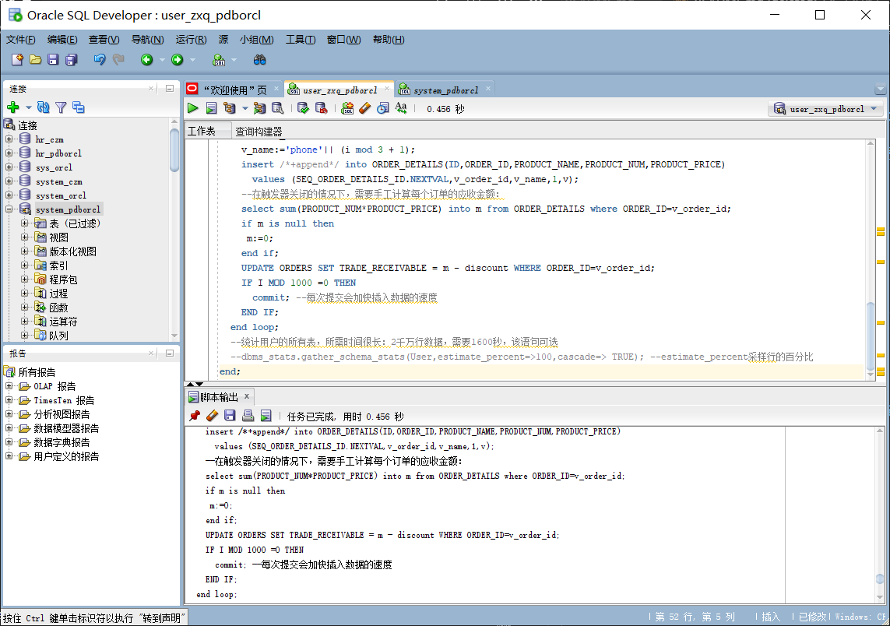

ALTER TRIGGER "ORDERS_TRIG_ROW_LEVEL" ENABLE;
ALTER TRIGGER "ORDER_DETAILS_SNTNS_TRIG" ENABLE;
ALTER TRIGGER "ORDER_DETAILS_ROW_TRIG" ENABLE;

### 14、最后动态增加一个PARTITION_BEFORE_2018分区：
ALTER TABLE ORDERS
ADD PARTITION PARTITION_BEFORE_2018 VALUES LESS THAN (TO_DATE(' 2018-01-01 00:00:00', 'SYYYY-MM-DD HH24:MI:SS', 'NLS_CALENDAR=GREGORIAN'));

ALTER INDEX ORDERS_INDEX_DATE
MODIFY PARTITION PARTITION_BEFORE_2018
NOCOMPRESS;
实验截图:
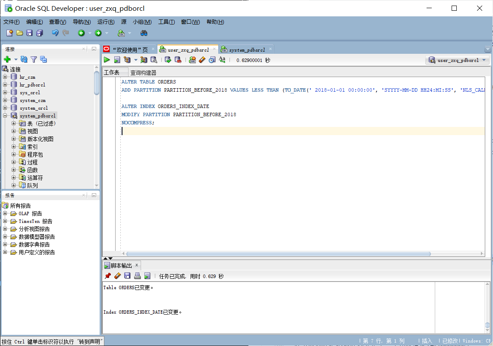

### 15、测试
select * from ORDERS where  order_id=1;
select * from ORDER_DETAILS where  order_id=1;
select * from VIEW_ORDER_DETAILS where order_id=1;
实验截图:
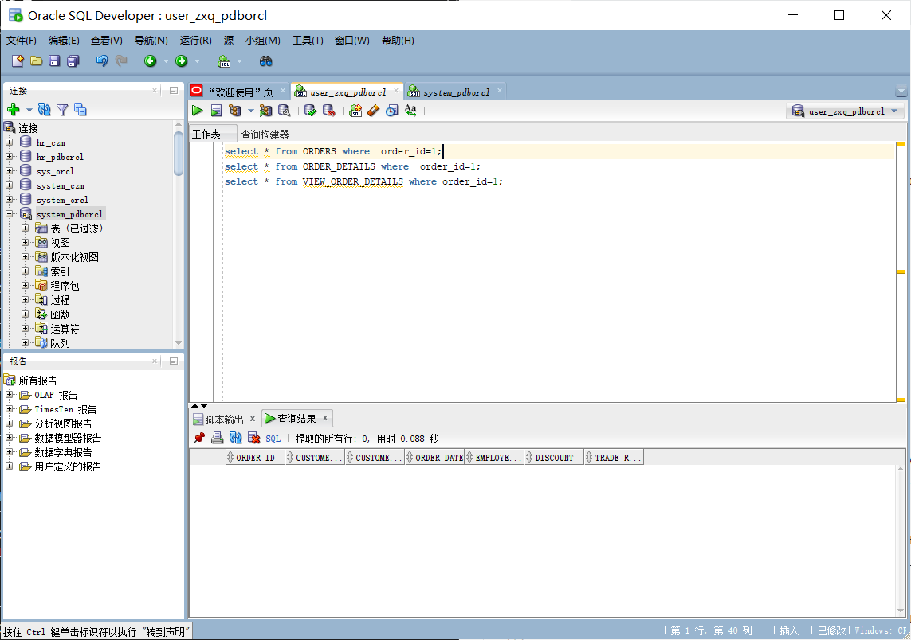

### 16、递归查询某个员工及其所有下属，子下属员工。
WITH A (EMPLOYEE_ID,NAME,EMAIL,PHONE_NUMBER,HIRE_DATE,SALARY,MANAGER_ID,DEPARTMENT_ID) AS
  (SELECT EMPLOYEE_ID,NAME,EMAIL,PHONE_NUMBER,HIRE_DATE,SALARY,MANAGER_ID,DEPARTMENT_ID
    FROM employees WHERE employee_ID = 11
    UNION ALL
  SELECT B.EMPLOYEE_ID,B.NAME,B.EMAIL,B.PHONE_NUMBER,B.HIRE_DATE,B.SALARY,B.MANAGER_ID,B.DEPARTMENT_ID
    FROM A, employees B WHERE A.EMPLOYEE_ID = B.MANAGER_ID)
SELECT * FROM A;
实验截图:
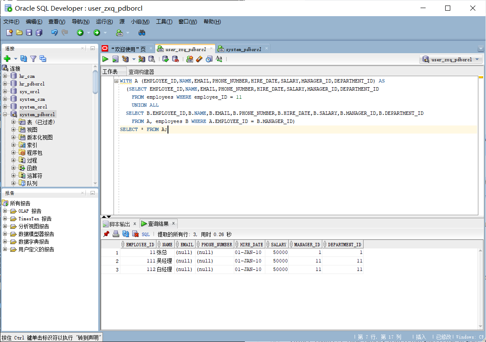

### 17、特殊查询语句和查询分区表情况:
select TABLE_NAME,PARTITION_NAME,HIGH_VALUE,PARTITION_POSITION,TABLESPACE_NAME from user_tab_partitions
实验截图:

### 18、查询分区索引情况：
select * from USER_IND_PARTITIONS;
实验截图:
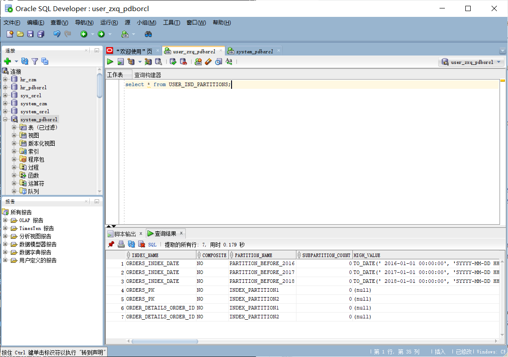

### 19、查询一个分区中的数据
select count(*) from ORDERS partition(PARTITION_BEFORE_2016);
select count(*) from ORDERS partition(PARTITION_BEFORE_2017);
实验截图:
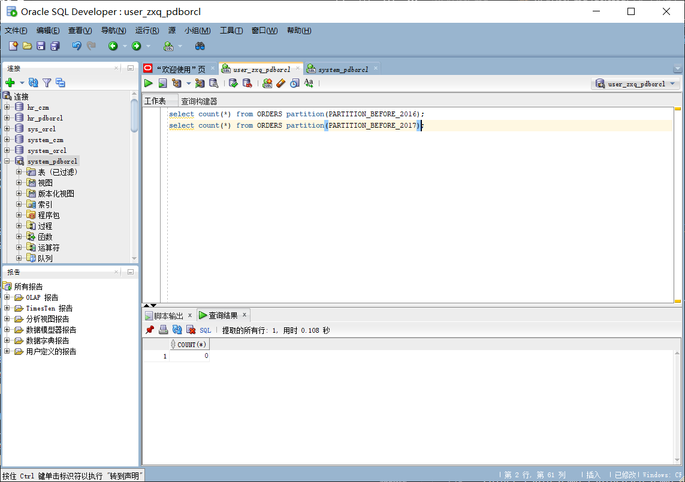

### 20、--收集表的统计信息dbms_stats.gather_table_stats
--也可以使用ANALYZE TABLE TableName COMPUTE STATISTICS; 但推荐使用dbms_stats.gather_table_stats
--分析单个表：
--exec dbms_stats.gather_table_stats(user,'ORDERS',cascade=>true); --cascade=true表示同时收集索引的信息
--exec dbms_stats.gather_table_stats(user,'ORDER_DETAILS',cascade=>true);
--统计用户的所有表：
exec dbms_stats.gather_schema_stats(User,estimate_percent=>100,cascade=> TRUE); --estimate_percent采样行的百分比
--统计完成后，查询表的统计信息：
select table_name,tablespace_name,num_rows from user_tables where table_name='ORDERS';
select table_name,tablespace_name,num_rows from user_tables where table_name='ORDER_DETAILS';

select * from orders where order_id=1300;
select * from ORDER_DETAILS where order_id=1300;
select * from orders where customer_name='zhang133000';
select * from orders where order_date<to_date('2016-01-01','yyyy-mm-dd');
实验截图:
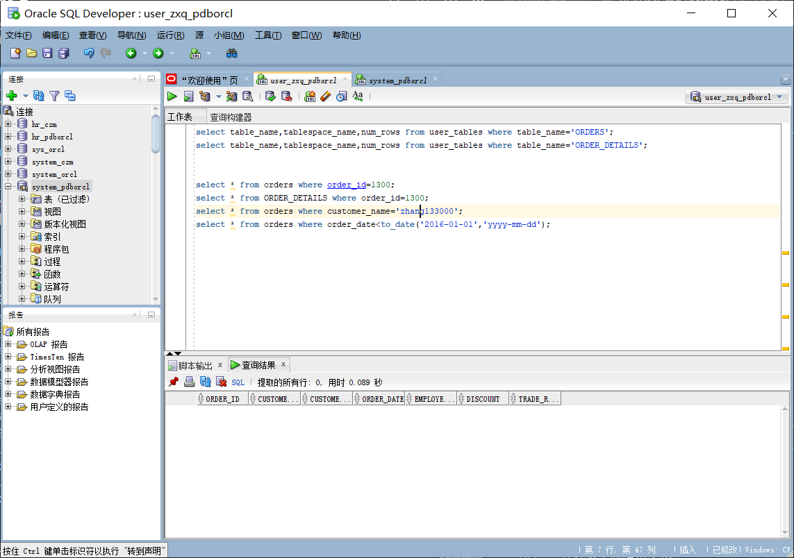

### 20、查看表空间使用大小
SELECT a.tablespace_name "表空间名",
total "表空间大小",
free "表空间剩余大小",
(total - free) "表空间使用大小",
total / (1024 * 1024 * 1024) "表空间大小(G)",
free / (1024 * 1024 * 1024) "表空间剩余大小(G)",
(total - free) / (1024 * 1024 * 1024) "表空间使用大小(G)",
round((total - free) / total, 4) * 100 "使用率 %"
FROM (SELECT tablespace_name, SUM(bytes) free
FROM dba_free_space
GROUP BY tablespace_name) a,
(SELECT tablespace_name, SUM(bytes) total
FROM dba_data_files
GROUP BY tablespace_name) b
WHERE a.tablespace_name = b.tablespace_name

--查看数据文件大小:
[oracle@cdh3 ~]$ ls -lh /home/oracle/app/oracle/oradata/orcl/pdbtest/pdbtest_users*
-rw-r----- 1 oracle root 3.8G 11月  1 14:53 /home/oracle/app/oracle/oradata/orcl/pdbtest/pdbtest_users01_2.dbf
-rw-r----- 1 oracle root 2.4G 11月  1 14:53 /home/oracle/app/oracle/oradata/orcl/pdbtest/pdbtest_users01.dbf
-rw-r----- 1 oracle root 1.5G 11月  1 14:53 /home/oracle/app/oracle/oradata/orcl/pdbtest/pdbtest_users02_1.dbf
-rw-r----- 1 oracle root 2.5G 11月  1 14:53 /home/oracle/app/oracle/oradata/orcl/pdbtest/pdbtest_users02_2.dbf
*/
实验截图:
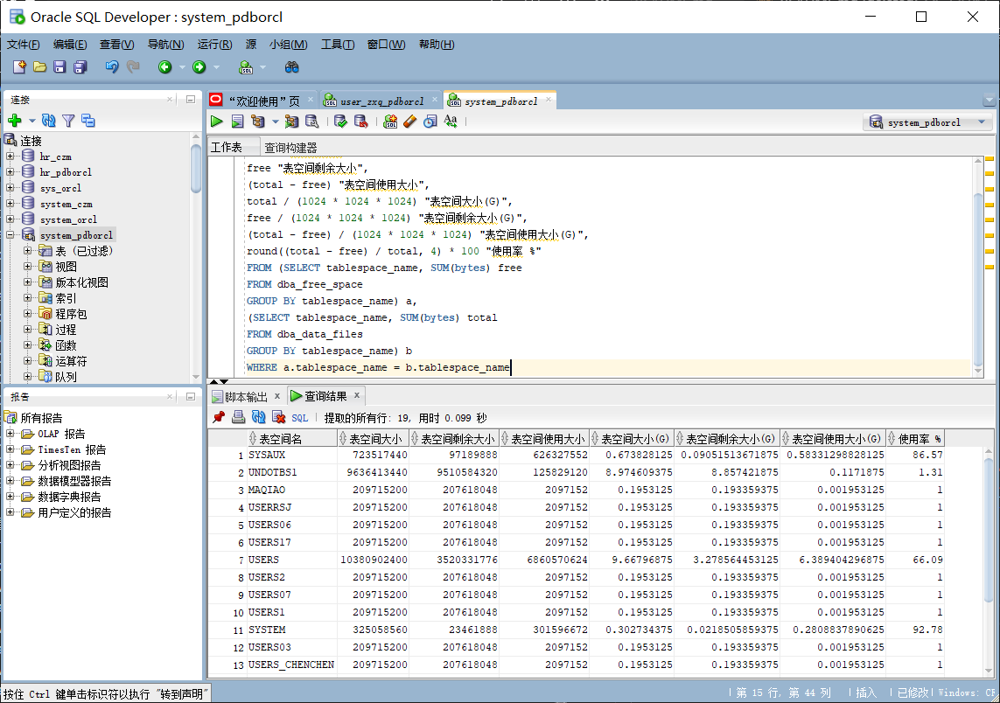