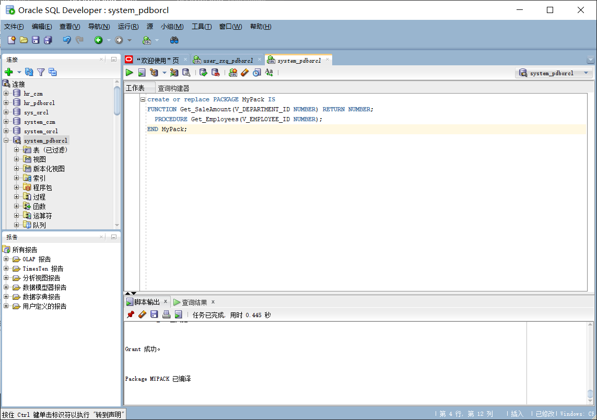
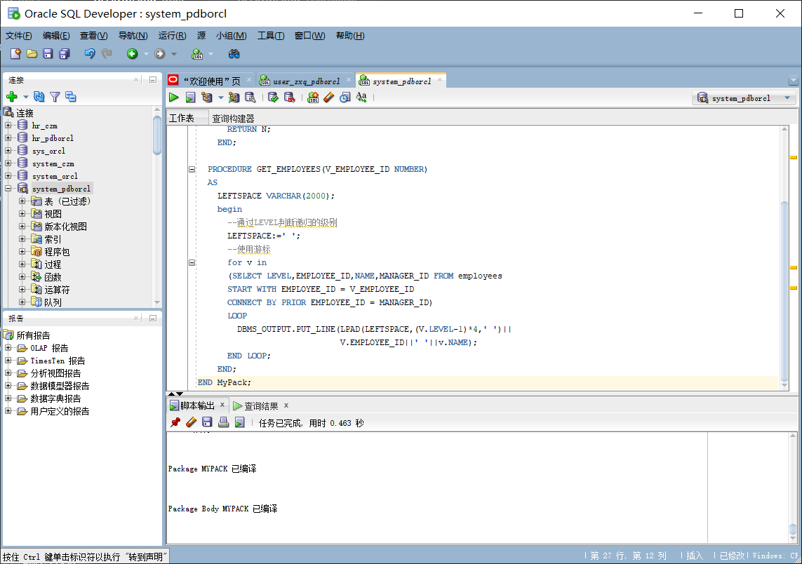
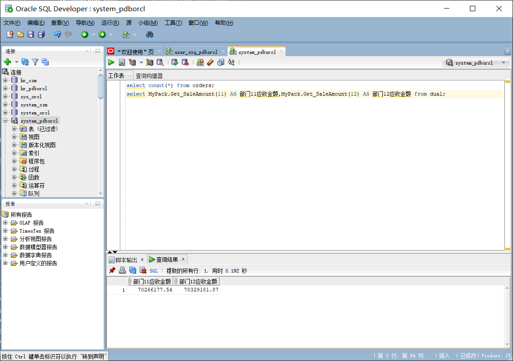
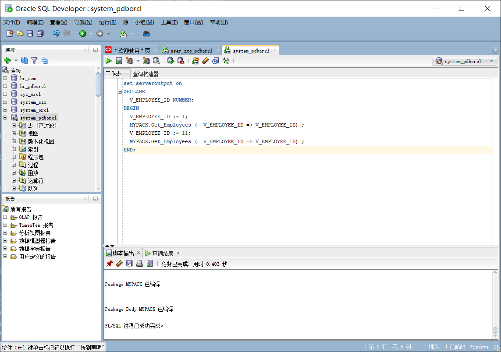

# 实验5
### 朱喜倩 201810414205 18软工2班
### github用户名 zhuxiqian
## 实验目的
了解PL/SQL语言结构
了解PL/SQL变量和常量的声明和使用方法
学习条件语句的使用方法
学习分支语句的使用方法
学习循环语句的使用方法
学习常用的PL/SQL函数
学习包，过程，函数的用法。
## 实验场景
- 假设有一个生产某个产品的单位，单位接受网上订单进行产品的销售。通过实验模拟这个单位的部分信息：员工表，部门表，订单表，订单详单表。
- 本实验以实验四为基础
## 实验内容
1. 创建一个包(Package)，包名是MyPack。

2. 在MyPack中创建一个函数SaleAmount ，查询部门表，统计每个部门的销售总金额，每个部门的销售额是由该部门的员工(ORDERS.EMPLOYEE_ID)完成的销售额之和。函数SaleAmount要求输入的参数是部门号，输出部门的销售金额。

3. 在MyPack中创建一个过程，在过程中使用游标，递归查询某个员工及其所有下属，子下属员工。过程的输入参数是员工号，输出员工的ID,姓名，销售总金额。信息用dbms_output包中的put或者put_line函数。输出的员工信息用左添加空格的多少表示员工的层次（LEVEL）。比如下面显示5个员工的信息：

4. 由于订单只是按日期分区的，上述统计是全表搜索，因此统计速度会比较慢，如何提高统计的速度呢？
   ID 姓名 销售总金额
=======================
2 张三   5000元
3 李四   6000元
4 王五   1000元
5 孙强   2000元
6 赵强东 5000 元
上述输出结果表示 2，6号两个员工是一个级别的，没有领导，3，4号员工的领导是2号，5号员工的领导是4号。 Oracle递归查询的语句格式是：
```
sql
SELECT LEVEL,EMPLOYEE_ID,NAME,MANAGER_ID FROM employees 
START WITH EMPLOYEE_ID = V_EMPLOYEE_ID 
CONNECT BY PRIOR EMPLOYEE_ID = MANAGER_ID
```
## 实验步骤
### 1、前提
```
 本实验以实验4为基础。
  包MyPack中有：
  一个函数:Get_SaleAmount(V_DEPARTMENT_ID NUMBER)，
  一个过程:Get_Employees(V_EMPLOYEE_ID NUMBER)
  */
  FUNCTION Get_SaleAmount(V_DEPARTMENT_ID NUMBER) RETURN NUMBER;
  PROCEDURE Get_Employees(V_EMPLOYEE_ID NUMBER);
END MyPack;
```
### 2、创建包MyPack
```
create or replace PACKAGE MyPack IS
FUNCTION Get_SaleAmount(V_DEPARTMENT_ID NUMBER) RETURN NUMBER;
  PROCEDURE Get_Employees(V_EMPLOYEE_ID NUMBER);
END MyPack;
```
实验截图:


### 3、创建函数Get_SaleAmount
```
create or replace PACKAGE BODY MyPack IS
  FUNCTION Get_SaleAmount(V_DEPARTMENT_ID NUMBER) RETURN NUMBER
  AS
    N NUMBER(20,2); --注意，订单ORDERS.TRADE_RECEIVABLE的类型是NUMBER(8,2),汇总之后，数据要大得多。
    BEGIN
      SELECT SUM(O.TRADE_RECEIVABLE) into N  FROM ORDERS O,EMPLOYEES E
      WHERE O.EMPLOYEE_ID=E.EMPLOYEE_ID AND E.DEPARTMENT_ID =V_DEPARTMENT_ID;
      RETURN N;
    END;

  PROCEDURE GET_EMPLOYEES(V_EMPLOYEE_ID NUMBER)
  AS
    LEFTSPACE VARCHAR(2000);
    begin
      --通过LEVEL判断递归的级别
      LEFTSPACE:=' ';
      --使用游标
      for v in
      (SELECT LEVEL,EMPLOYEE_ID,NAME,MANAGER_ID FROM employees
      START WITH EMPLOYEE_ID = V_EMPLOYEE_ID
      CONNECT BY PRIOR EMPLOYEE_ID = MANAGER_ID)
      LOOP
        DBMS_OUTPUT.PUT_LINE(LPAD(LEFTSPACE,(V.LEVEL-1)*4,' ')||
                             V.EMPLOYEE_ID||' '||v.NAME);
      END LOOP;
    END;
END MyPack;
```
实验截图:


### 4、测试函数Get_SaleAmount()
```
select count(*) from orders;
select MyPack.Get_SaleAmount(11) AS 部门11应收金额,MyPack.Get_SaleAmount(12) AS 部门12应收金额 from dual;
```
实验截图:


### 5、测试过程Get_Employees()
```
set serveroutput on
DECLARE
  V_EMPLOYEE_ID NUMBER;    
BEGIN
  V_EMPLOYEE_ID := 1;
  MYPACK.Get_Employees (  V_EMPLOYEE_ID => V_EMPLOYEE_ID) ;  
  V_EMPLOYEE_ID := 11;
  MYPACK.Get_Employees (  V_EMPLOYEE_ID => V_EMPLOYEE_ID) ;    
END;
```
实验截图:


## 实验总结
通过本次实验，我了解PL/SQL语言结构，还了解PL/SQL变量和常量的声明和使用方法。同时我也学习了条件语句的使用方法、分支语句的使用方法、循环语句的使用方法，也了解到了常用的PL/SQL函数，并且也对其有更了进一步的认识，通过这次实验的锻炼，我也学习了包，过程，函数的用法。