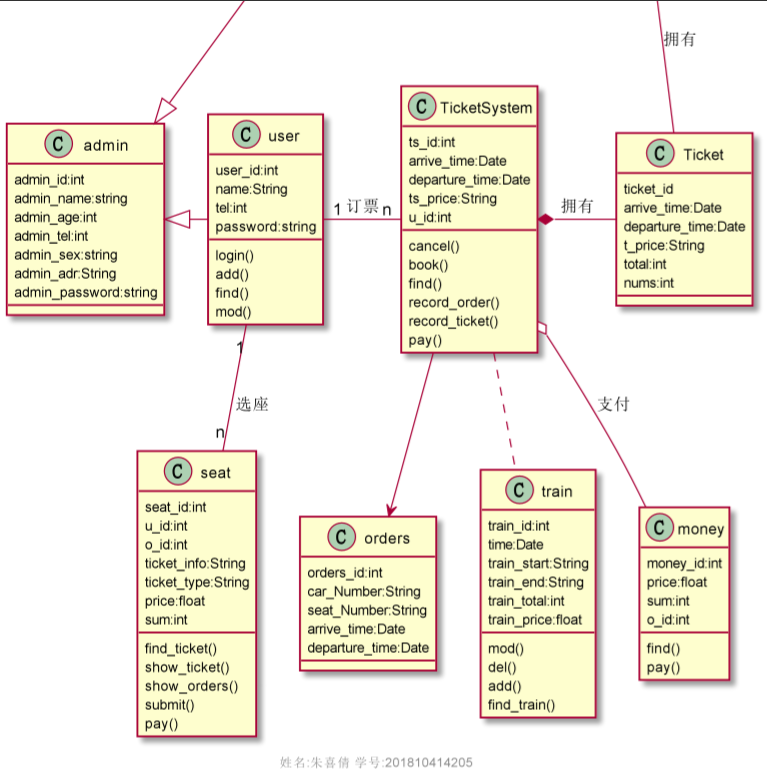

# 实验6
### 朱喜倩 201810414205 18软工2班
### github用户名 zhuxiqian

## 实验目的及要求

1. 自行设计一个信息系统的数据库项目，自拟 某项目 名称。

2. 设计项目涉及的表及表空间使用方案。至少5张表和5万条数据，两个表空间。

3. 设计权限及用户分配方案。至少两类角色，两个用户。

4. 在数据库中建立一个程序包，在包中用PL/SQL语言设计一些存储过程和函数，

5. 实现比较复杂的业务逻辑，用模拟数据进行执行计划分析。

6. 设计自动备份方案或则手工备份方案。

7. 设计容灾方案。使用两台主机，通过DataGuard实现数据库整体的异地备份(可选)。

## 实验选题: 基于oracle网上售票管理系统

## 实验内容
### (一) 自行设计一个信息系统的数据库项目，自拟 某项目 名称

1. 网上售票管理系统，用户能在该系统完成查询、订票、改票、退票等操作。实验部分信息：admin，manager，user，ManagerTicket，Ticket，TicketSystem，seat，orders，train，money。

2. E-R图设计

3. 类图设计  
类图说明：  
（1）admin类是管理员和用户的统称，有admin_id,admin_name（名字）,admin_age（年龄）,admin_tel（联系电话）,admin_sex（性别）,admin_adr（地址）,admin_password（密码）属性。  
（2）manager是用于存放管理员信息的类，它继承了admin类，有manager_id,manager_name（名字）,manager_age（年龄）,manager_tel（联系电话）,manager_sex（性别）,manager_adr（地址）,manager_password（密码）属性；有登录的方法，同时还有增、删、查、改四个基本方法。  
（3）user是用于存放用户信息的类，它继承了admin类，有user_id,user_name（姓名）,user_tel（联系电话）,user_password（密码）四个属性；有登录的方法名，因为用户没有删除权限，所以只有增、查、改三个基本方法。  
（4）ManagerTicket是票务管理类，可以用于修改票价、删除票务信息等功能，它有mt_id,mt_price（价格）,arrive_time（到达时间），departure_time（离开时间）四个属性；有增、删、查、改四个基本方法。  
（5）Ticket类是用于存放票务信息的类，有ticket_id,t_price（价格）,arrive_time（到达时间），departure_time（离开时间）,total（票的总数）,nums（余票数量）。  
（6）TicketSystem是票务系统类，可以用于用户查询订单、查询票价、查询余票等功能，有ts_id,ts_price（价格）,arrive_time（到达时间），departure_time（离开时间）,u_id（用户id）；方法有cancel（退票），book（订票），record_ticket（记录火车票），record_order（记录订单），pay（支付）等方法。  
（7）seat类是用于选座的类，它有seat_id,u_id,o_id（订单id）,ticket_info（车票详情）,ticket_type（车票种类）,seat_price,sum（车票剩余量）等熟悉有show_orders()方法，用于显示订单详情，find_ticket()方法，用于查找车票，show_ticket()方法，用于显示车票，pay（支付）等方法。  
（8）orders是订单类，用于存放用户订票之后产生的订单。有orders_id,car_Number（列车号），seat_Number（座位号），arrive_time（到达时间），departure_time（离开时间），跟TicketSystem是关联的。  
（9）train是用于存放列车的实体类。它有train_id,time，train_start，train_end,train_total，train_price属性，其中time是指列车运行的时间，train_start是指列车起始点，train_end是指终点站，train_total是指每一天运行的列车总数量，train_price是指某趟列车的价格。  
（10）money是用于支付功能的类，有money_id,price,sum,o_id四个属性；有find和pay两个方法。Find方法是用于来查找订单，确定支付多少钱。它与TicketSystem是聚合关系。  

### （二） 设计项目涉及的表及表空间使用方案。至少5张表和5万条数据，两个表空间
1. 设计表  

admin
|  字段名   | 数据类型   |  可以为空   |  注释                |
|  ----     |   ----    |     ----    | ----                |
| ADMIN_ID  | NUMBER(6,0) | NO  | adminID,主键          |
| ADMIN_NAME| VARCHAR2(40 BYTE) | NO  | admin名称，非空 |
| ADMIN_AGE | NUMBER(6,0) | NO  | admin年龄，非空 |
| ADMIN_TEL | NUMBER(13,0) | NO  | admin电话，非空 |
| ADMIN_SEX | VARCHAR2(40 BYTE) | NO  | admin性别，非空 |
| ADMIN_ADR | VARCHAR2(40 BYTE) | NO  | admin地址，非空 |
| ADMIN_PASSWORD| VARCHAR2(40 BYTE) | NO  | admin密码，非空 |

manager(员工)
|  字段名   | 数据类型   |  可以为空   |  注释                |
|  ----     |   ----    |     ----    | ----                |
| MANAGER_ID  | NUMBER(6,0) | NO  | 员工ID,主键          |
| MANAGER_MANE| VARCHAR2(40 BYTE) | NO  | 员工名字,不能为空，创建不唯一B树索引 |
| MANAGER_AGE | VARCHAR2(40 BYTE)  | YES  | 员工年龄         |
| MANAGER_TEL| VARCHAR2(40 BYTE) | YES  | 员工电话号码 |
| MANAGER_SEX | VARCHAR2(40 BYTE) | NO  | 员工性别     |
| MANAGER_ADR|VARCHAR2(40 BYTE) | NO  | 员工地址 |
| ADMIN_ID  | NUMBER(6,0) | NO  | adminID,员工表EMPLOYEES_ID 的外键 不能与MANAGER_ID相等|
| MANAGER_PASSWORD| VARCHAR2(40 BYTE) | NO  | 员工密码 |

user(用户)
|  字段名   | 数据类型   |  可以为空   |  注释                |
|  ----     |   ----    |     ----    | ----                |
| USER_ID  | NUMBER(6,0) | NO  | 用户ID,主键          |
| USER_NAME| VARCHAR2(40 BYTE) | NO  | 用户名称，非空 |
| USER_AGE| NUMBER(6,0) | NO  |  用户年龄，非空 |
| USER_TEL| NUMBER(13,0) | NO  | 用户电话，非空 |
| USER_SEX| VARCHAR2(40 BYTE) | NO  | 用户性别，非空 |
| USER_ADR| VARCHAR2(40 BYTE) | NO  | 用户地址，非空 |
| USER_PASSWORD| VARCHAR2(40 BYTE) | NO  | 用户密码，非空 |
| ADMIN_ID  | NUMBER(6,0) | NO  | adminID,员工表EMPLOYEES_ID 的外键 不能与MANAGER_ID相等|

ManagerTicket
|  字段名   | 数据类型   |  可以为空   |  注释       |
|  ----     |   ----    |     ----    | ----       |
| MANAGERTICKET_ID  | NUMBER(6,0) | NO  | 票务ID,主键    |
| MANAGERTICKET_arrive_time| VARCHAR2(40 BYTE) | NO  | 列表到达时间 |
| MANAGERTICKET_departure_time| VARCHAR2(40 BYTE) | NO  | 列车出发时间 |
| MANAGERTICKET_PRICE  | NUMBER(6,0) | NO  | 票务票价,主键    |

TICKET(票务详情)
|  字段名   | 数据类型   |  可以为空   |  注释       |
|  ----     |   ----    |     ----    | ----       |
| TICKET_ID  | NUMBER(10,0) | NO  | 票务详情ID,主键,值来自于ManagerTicket_ID|
| TICKET_PRICE| NUMBER(10,0) | NO  | 票务价格 |
|  TICKET_arrive_time| VARCHAR2(40 BYTE) | NO  | 列表到达时间 |
|  TICKET_departure_time | NUMBER(8,2) | NO  | 车出发时间|
|  TICKET_TOTAL| NUMBER(8,2) | NO  | 票务总数量|
|  TICKET_NUMS| NUMBER(8,2) | NO  | 每类票务的数量|

ORDERS(订单)
|  字段名   | 数据类型   |  可以为空   |  注释       |
|  ----     |   ----    |     ----    | ----       |
| ORDER_ID  | NUMBER(10,0) | NO  | 订单ID,主键|
| USER_NAME| VARCHAR2(40 BYTE) | NO  | 用户名称，B数索引 |
| USER_TEL| VARCHAR2(40 BYTE) | NO  | 用户电话 |
| ORDER_DATE  | DATE | NO  | 订单日期，应该采用分区储存方式 |
| MANAGER_ID| NUMBER(6,0 | NO  | 订单经手人，员工表MANAGER的外键|
| DISCOUNT| Number(8,2) | YES  | 订单整体优惠金额，默认为0 |
| TRADE_RECEIVABLE  | Number(8,2)  | YES  | 订单应收货款，默认为0    |

train(列车详情)
|  字段名   | 数据类型   |  可以为空   |  注释       |
|  ----     |   ----    |     ----    | ----       |
| TRAIN_ID  | NUMBER(10,0) | NO  | 列车详情ID,主键,值来自于ORDERS_ID|
| TRAIN_TIME| date | NO  | 列车每趟运行时长 |
| TRAIN_start| date | NO  | 列车出发时间 |
| TRAIN_end  | date | NO  | 列车到达时间|
| TRAIN_total| NUMBER(8,2) | NO  | 每趟列车的总数量|
| TRAIN_price| VARCHAR2(40 BYTE) | NO  | 票价|

money(支付)
|  字段名   | 数据类型   |  可以为空   |  注释       |
|  ----     |   ----    |     ----    | ----       |
| MONEY_ID  | NUMBER(10,0) | NO  | 支付详情ID,主键|
| MONEY_PRICE|  NUMBER(10,0) | NO  | 每次支付的价格，用户购买的票的票价 |
| MONEY_SUM|  NUMBER(10,0) | NO  | 每次购买的票的数量 |
| ORDERS_ID  | NUMBER(6,0) | NO  | 订单的ID作为外键 |

2. 创建表空间 pdbtest_users1.dbf 与 pdbtest_users2.dbf

    CREATE TABLESPACE Users
    DATAFILE
    '/home/oracle/app/oracle/oradata/orcl/pdborcl/pdbtest_users1.dbf'
    SIZE 100M AUTOEXTEND ON NEXT 256M MAXSIZE UNLIMITED,
    '/home/oracle/app/oracle/oradata/orcl/pdborcl/pdbtest_users2.dbf'
    SIZE 100M AUTOEXTEND ON NEXT 256M MAXSIZE UNLIMITED
    EXTENT MANAGEMENT LOCAL SEGMENT SPACE MANAGEMENT AUTO;  

3. 创建用户YUKINO与DEEPSNOW
分配表空间pdbtest_users1.dbf 与 pdbtest_users2.dbf的使用配额，再分配角色CONNECT和RESOURCE,便于用户可以连接到数据库来创建资源，最后再分配一个系统权限："CREATE VIEW"，便于用户可以创建视图

    --创建用户YUKINO
    CREATE USER YUKINO IDENTIFIED BY 123
    DEFAULT TABLESPACE "USERS"
    TEMPORARY TABLESPACE "TEMP";

    -- QUOTAS
    ALTER USER YUKINO QUOTA UNLIMITED ON USERS;
    ALTER USER YUKINO QUOTA UNLIMITED ON USERS02;

    -- ROLES
    GRANT "CONNECT" TO YUKINO WITH ADMIN OPTION;
    GRANT "RESOURCE" TO YUKINO WITH ADMIN OPTION;
    ALTER USER YUKINO DEFAULT ROLE "CONNECT","RESOURCE";

    -- SYSTEM PRIVILEGES
    GRANT CREATE VIEW TO YUKINO WITH ADMIN OPTION;

    --创建用户DEEPSNOW
    CREATE USER DEEPSNOW IDENTIFIED BY 123
    DEFAULT TABLESPACE "USERS"
    TEMPORARY TABLESPACE "TEMP";

    -- QUOTAS
    ALTER USER DEEPSNOW QUOTA UNLIMITED ON USERS;
    ALTER USER DEEPSNOW QUOTA UNLIMITED ON USERS02;

    -- ROLES
    GRANT "CONNECT" TO DEEPSNOW WITH ADMIN OPTION;
    GRANT "RESOURCE" TO DEEPSNOW WITH ADMIN OPTION;
    ALTER USER DEEPSNOW DEFAULT ROLE "CONNECT","RESOURCE";

    -- SYSTEM PRIVILEGES
    GRANT CREATE VIEW TO DEEPSNOW WITH ADMIN OPTION;

4. 创建表
创建ADMIN表

    CREATE TABLE ADMIN
    (
    ADMIN_ID NUMBER(6, 0) NOT NULL
    , ADMIN_NAME VARCHAR2(40 BYTE) NOT NULL
    , CONSTRAINT ADMIN_PK PRIMARY KEY
    (
        ADMIN_ID
    )
    USING INDEX
    (
        CREATE UNIQUE INDEX DEPARTMENTS_PK ON ADMIN (DEPARTMENT_ID ASC)
        NOLOGGING
        TABLESPACE USERS
        PCTFREE 10
        INITRANS 2
        STORAGE
        (
            INITIAL 65536
            NEXT 1048576
            MINEXTENTS 1
            MAXEXTENTS UNLIMITED
            BUFFER_POOL DEFAULT
        )
        NOPARALLEL
    )
    ENABLE
    )
    NOLOGGING
    TABLESPACE USERS
    PCTFREE 10
    INITRANS 1
    STORAGE
    (
    INITIAL 65536
    NEXT 1048576
    MINEXTENTS 1
    MAXEXTENTS UNLIMITED
    BUFFER_POOL DEFAULT
    )
    NOCOMPRESS NO INMEMORY NOPARALLEL;

创建MANAGER表

    CREATE TABLE MANAGER
    (
    MANAGER_ID NUMBER(6, 0) NOT NULL
    , NAME VARCHAR2(40 BYTE) NOT NULL
    , EMAIL VARCHAR2(40 BYTE)
    , PHONE_NUMBER VARCHAR2(40 BYTE)
    , HIRE_DATE DATE NOT NULL
    , SALARY NUMBER(8, 2)
    , MANAGER_ID NUMBER(6, 0)
    , MANAGER_ID NUMBER(6, 0)
    , PHOTO BLOB
    , CONSTRAINT MANAGER_PK PRIMARY KEY
    (
        EMPLOYEE_ID
    )
    USING INDEX
    (
        CREATE UNIQUE INDEX EMPLOYEES_PK ON EMPLOYEES (EMPLOYEE_ID ASC)
        NOLOGGING
        TABLESPACE USERS
        PCTFREE 10
        INITRANS 2
        STORAGE
        (
            INITIAL 65536
            NEXT 1048576
            MINEXTENTS 1
            MAXEXTENTS UNLIMITED
            BUFFER_POOL DEFAULT
        )
        NOPARALLEL
    )
    ENABLE
    )
    NOLOGGING
    TABLESPACE USERS
    PCTFREE 10
    INITRANS 1
    STORAGE
    (
    INITIAL 65536
    NEXT 1048576
    MINEXTENTS 1
    MAXEXTENTS UNLIMITED
    BUFFER_POOL DEFAULT
    )
    NOCOMPRESS
    NO INMEMORY
    NOPARALLEL
    LOB (PHOTO) STORE AS SYS_LOB0000092017C00009$$
    (
    ENABLE STORAGE IN ROW
    CHUNK 8192
    NOCACHE
    NOLOGGING
    TABLESPACE USERS
    STORAGE
    (
        INITIAL 106496
        NEXT 1048576
        MINEXTENTS 1
        MAXEXTENTS UNLIMITED
        BUFFER_POOL DEFAULT
    )
    );

    CREATE INDEX MANAGER_INDEX1_NAME ON MANAGER (NAME ASC)
    NOLOGGING
    TABLESPACE USERS
    PCTFREE 10
    INITRANS 2
    STORAGE
    (
    INITIAL 65536
    NEXT 1048576
    MINEXTENTS 1
    MAXEXTENTS UNLIMITED
    BUFFER_POOL DEFAULT
    )
    NOPARALLEL;

    ALTER TABLE MANAGER
    ADD CONSTRAINT MANAGER_FK1 FOREIGN KEY
    (
    DEPARTMENT_ID
    )
    REFERENCES DEPARTMENTS
    (
    DEPARTMENT_ID
    )
    ENABLE;

    ALTER TABLE MANAGER
    ADD CONSTRAINT MANAGER_FK2 FOREIGN KEY
    (
    MANAGER_ID
    )
    REFERENCES MANAGER
    (
    EMPLOYEE_ID
    )
    ON DELETE SET NULL ENABLE;

    ALTER TABLE MANAGER
    ADD CONSTRAINT MANAGER_CHK1 CHECK
    (SALARY>0)
    ENABLE;

    ALTER TABLE MANAGER
    ADD CONSTRAINT MANAGER_CHK2 CHECK
    (MANAGER_ID<>MANAGER_ID)
    ENABLE;

    ALTER TABLE MANAGER
    ADD CONSTRAINT MANAGER_MANAGER_MANAGER_ID CHECK
    (USER_ID<>MANAGER_ID)
    ENABLE;

    ALTER TABLE MANAGER
    ADD CONSTRAINTMANAGER_SALARY CHECK
    (SALARY>0)
    ENABLE;

创建TICKET表

    CREATE TABLE TICKET
    (
    TICKET_NAME VARCHAR2(40 BYTE) NOT NULL
    , TICKET_TYPE VARCHAR2(40 BYTE) NOT NULL
    , CONSTRAINT TICKET_PK PRIMARY KEY
    (
        TICKET_NAME
    )
    ENABLE
    )
    LOGGING
    TABLESPACE "USERS"
    PCTFREE 10
    INITRANS 1
    STORAGE
    (
    INITIAL 65536
    NEXT 1048576
    MINEXTENTS 1
    MAXEXTENTS 2147483645
    BUFFER_POOL DEFAULT
    );

    ALTER TABLE TICKET
    ADD CONSTRAINT TICKET_CHK1 CHECK
    (TICKET_TYPE IN ('食品', '饮料', '生活用品'))
    ENABLE;

创建ORDERS表及相关表, 表空间：分区表：USERS,USERS02

    CREATE GLOBAL TEMPORARY TABLE "ORDER_ID_TEMP"
    ("ORDER_ID" NUMBER(10,0) NOT NULL ENABLE,
        CONSTRAINT "ORDER_ID_TEMP_PK" PRIMARY KEY ("ORDER_ID") ENABLE
    ) ON COMMIT DELETE ROWS ;

    COMMENT ON TABLE "ORDER_ID_TEMP"  IS '用于触发器存储临时ORDER_ID';

    CREATE TABLE ORDERS
    (
    ORDER_ID NUMBER(10, 0) NOT NULL
    , CUSTOMER_NAME VARCHAR2(40 BYTE) NOT NULL
    , CUSTOMER_TEL VARCHAR2(40 BYTE) NOT NULL
    , ORDER_DATE DATE NOT NULL
    , EMPLOYEE_ID NUMBER(6, 0) NOT NULL
    , DISCOUNT NUMBER(8, 2) DEFAULT 0
    , TRADE_RECEIVABLE NUMBER(8, 2) DEFAULT 0
    )
    TABLESPACE USERS
    PCTFREE 10
    INITRANS 1
    STORAGE
    (
    BUFFER_POOL DEFAULT
    )
    NOCOMPRESS
    NOPARALLEL
    PARTITION BY RANGE (ORDER_DATE)
    (
    PARTITION PARTITION_BEFORE_2016 VALUES LESS THAN (TO_DATE(' 2016-01-01 00:00:00', 'SYYYY-MM-DD HH24:MI:SS', 'NLS_CALENDAR=GREGORIAN'))
    NOLOGGING
    TABLESPACE USERS
    PCTFREE 10
    INITRANS 1
    STORAGE
    (
        INITIAL 8388608
        NEXT 1048576
        MINEXTENTS 1
        MAXEXTENTS UNLIMITED
        BUFFER_POOL DEFAULT
    )
    NOCOMPRESS NO INMEMORY
    , PARTITION PARTITION_BEFORE_2017 VALUES LESS THAN (TO_DATE(' 2017-01-01 00:00:00', 'SYYYY-MM-DD HH24:MI:SS', 'NLS_CALENDAR=GREGORIAN'))
    NOLOGGING
    TABLESPACE USERS02
    PCTFREE 10
    INITRANS 1
    STORAGE
    (
        INITIAL 8388608
        NEXT 1048576
        MINEXTENTS 1
        MAXEXTENTS UNLIMITED
        BUFFER_POOL DEFAULT
    )
    NOCOMPRESS NO INMEMORY
    );

--创建本地分区索引ORDERS_INDEX_DATE：

    CREATE INDEX ORDERS_INDEX_DATE ON ORDERS (ORDER_DATE ASC)
    LOCAL
    (
    PARTITION PARTITION_BEFORE_2016
        TABLESPACE USERS
        PCTFREE 10
        INITRANS 2
        STORAGE
        (
        INITIAL 8388608
        NEXT 1048576
        MINEXTENTS 1
        MAXEXTENTS UNLIMITED
        BUFFER_POOL DEFAULT
        )
        NOCOMPRESS
    , PARTITION PARTITION_BEFORE_2017
        TABLESPACE USERS02
        PCTFREE 10
        INITRANS 2
        STORAGE
        (
        INITIAL 8388608
        NEXT 1048576
        MINEXTENTS 1
        MAXEXTENTS UNLIMITED
        BUFFER_POOL DEFAULT
        )
        NOCOMPRESS
    )
    STORAGE
    (
    BUFFER_POOL DEFAULT
    )
    NOPARALLEL;

    CREATE INDEX ORDERS_INDEX_CUSTOMER_NAME ON ORDERS (CUSTOMER_NAME ASC)
    NOLOGGING
    TABLESPACE USERS
    PCTFREE 10
    INITRANS 2
    STORAGE
    (
    INITIAL 65536
    NEXT 1048576
    MINEXTENTS 1
    MAXEXTENTS UNLIMITED
    BUFFER_POOL DEFAULT
    )
    NOPARALLEL;

    CREATE UNIQUE INDEX ORDERS_PK ON ORDERS (ORDER_ID ASC)
    GLOBAL PARTITION BY HASH (ORDER_ID)
    (
    PARTITION INDEX_PARTITION1 TABLESPACE USERS
        NOCOMPRESS
    , PARTITION INDEX_PARTITION2 TABLESPACE USERS02
        NOCOMPRESS
    )
    NOLOGGING
    TABLESPACE USERS
    PCTFREE 10
    INITRANS 2
    STORAGE
    (
    INITIAL 65536
    NEXT 1048576
    MINEXTENTS 1
    MAXEXTENTS UNLIMITED
    BUFFER_POOL DEFAULT
    )
    NOPARALLEL;

    ALTER TABLE ORDERS
    ADD CONSTRAINT ORDERS_PK PRIMARY KEY
    (
    ORDER_ID
    )
    USING INDEX ORDERS_PK
    ENABLE;

    ALTER TABLE ORDERS
    ADD CONSTRAINT ORDERS_FK1 FOREIGN KEY
    (
    EMPLOYEE_ID
    )
    REFERENCES EMPLOYEES
    (
    EMPLOYEE_ID
    )
    ENABLE;

    CREATE TABLE MANAGERTICKET
    (
    ID NUMBER(10, 0) NOT NULL
    , MANAGERTICKET_ID NUMBER(10, 0) NOT NULL
    , MANAGERTICKET_NAME VARCHAR2(40 BYTE) NOT NULL
    , MANAGERTICKET_NUM NUMBER(8, 2) NOT NULL
    , MANAGERTICKET_PRICE NUMBER(8, 2) NOT NULL
    , CONSTRAINT MANAGERTICKET  _DETAILS_FK1 FOREIGN KEY
    (
    ORDER_ID
    )
    REFERENCES ORDERS
    (
    ORDER_ID
    )
    ENABLE
    )
    TABLESPACE USERS
    PCTFREE 10
    INITRANS 1
    STORAGE
    (
    BUFFER_POOL DEFAULT
    )
    NOCOMPRESS
    NOPARALLEL
    PARTITION BY REFERENCE (ORDER_DETAILS_FK1)
    (
    PARTITION PARTITION_BEFORE_2016
    NOLOGGING
    TABLESPACE USERS 
    --必须指定表空间，否则会将分区存储在用户的默认表空间中
    PCTFREE 10
    INITRANS 1
    STORAGE
    (
        INITIAL 8388608
        NEXT 1048576
        MINEXTENTS 1
        MAXEXTENTS UNLIMITED
        BUFFER_POOL DEFAULT
    )
    NOCOMPRESS NO INMEMORY,
    PARTITION PARTITION_BEFORE_2017
    NOLOGGING
    TABLESPACE USERS02
    PCTFREE 10
    INITRANS 1
    STORAGE
    (
        INITIAL 8388608
        NEXT 1048576
        MINEXTENTS 1
        MAXEXTENTS UNLIMITED
        BUFFER_POOL DEFAULT
    )
    NOCOMPRESS NO INMEMORY
    )
    ;

    CREATE UNIQUE INDEX ORDER_DETAILS_PK ON ORDER_DETAILS (ID ASC)
    NOLOGGING
    TABLESPACE USERS
    PCTFREE 10
    INITRANS 2
    STORAGE
    (
    INITIAL 65536
    NEXT 1048576
    MINEXTENTS 1
    MAXEXTENTS UNLIMITED
    BUFFER_POOL DEFAULT
    )
    NOPARALLEL;

    ALTER TABLE ORDER_DETAILS
    ADD CONSTRAINT ORDER_DETAILS_PK PRIMARY KEY
    (
    ID
    )
    USING INDEX ORDER_DETAILS_PK
    ENABLE;

--这个索引可以使整个订单的详单存放在一起

    CREATE INDEX ORDER_DETAILS_ORDER_ID ON ORDER_DETAILS (ORDER_ID)
    GLOBAL PARTITION BY HASH (ORDER_ID)
    (
    PARTITION INDEX_PARTITION1 TABLESPACE USERS
        NOCOMPRESS
    , PARTITION INDEX_PARTITION2 TABLESPACE USERS02
        NOCOMPRESS
    );

    ALTER TABLE ORDER_DETAILS
    ADD CONSTRAINT ORDER_DETAILS_PRODUCT_NUM CHECK
    (Product_Num>0)
    ENABLE;

创建3个触发器

    CREATE OR REPLACE EDITIONABLE TRIGGER "ORDERS_TRIG_ROW_LEVEL"
    BEFORE INSERT OR UPDATE OF DISCOUNT ON "ORDERS"
    FOR EACH ROW --行级触发器
    declare
    m number(8,2);
    BEGIN
    if inserting then
        :new.TRADE_RECEIVABLE := - :new.discount;
    else
        select sum(PRODUCT_NUM*PRODUCT_PRICE) into m from ORDER_DETAILS where ORDER_ID=:old.ORDER_ID;
        if m is null then
            m:=0;
        end if;
        :new.TRADE_RECEIVABLE := m - :new.discount;
    end if;
    END;
    /
--批量插入订单数据之前，禁用触发器

    ALTER TRIGGER "ORDERS_TRIG_ROW_LEVEL" DISABLE;

    CREATE OR REPLACE EDITIONABLE TRIGGER "ORDER_DETAILS_ROW_TRIG"
    AFTER DELETE OR INSERT OR UPDATE  ON ORDER_DETAILS
    FOR EACH ROW
    BEGIN
    --DBMS_OUTPUT.PUT_LINE(:NEW.ORDER_ID);
    IF :NEW.ORDER_ID IS NOT NULL THEN
        MERGE INTO ORDER_ID_TEMP A
        USING (SELECT 1 FROM DUAL) B
        ON (A.ORDER_ID=:NEW.ORDER_ID)
        WHEN NOT MATCHED THEN
        INSERT (ORDER_ID) VALUES(:NEW.ORDER_ID);
    END IF;
    IF :OLD.ORDER_ID IS NOT NULL THEN
        MERGE INTO ORDER_ID_TEMP A
        USING (SELECT 1 FROM DUAL) B
        ON (A.ORDER_ID=:OLD.ORDER_ID)
        WHEN NOT MATCHED THEN
        INSERT (ORDER_ID) VALUES(:OLD.ORDER_ID);
    END IF;
    END;
    /
    ALTER TRIGGER "ORDER_DETAILS_ROW_TRIG" DISABLE;

    CREATE OR REPLACE EDITIONABLE TRIGGER "ORDER_DETAILS_SNTNS_TRIG"
    AFTER DELETE OR INSERT OR UPDATE ON ORDER_DETAILS
    declare
    m number(8,2);
    BEGIN
    FOR R IN (SELECT ORDER_ID FROM ORDER_ID_TEMP)
    LOOP
        --DBMS_OUTPUT.PUT_LINE(R.ORDER_ID);
        select sum(PRODUCT_NUM*PRODUCT_PRICE) into m from ORDER_DETAILS
        where ORDER_ID=R.ORDER_ID;
        if m is null then
        m:=0;
        end if;
        UPDATE ORDERS SET TRADE_RECEIVABLE = m - discount
        WHERE ORDER_ID=R.ORDER_ID;
    END LOOP;
    --delete from ORDER_ID_TEMP;
    END;
    /
    ALTER TRIGGER "ORDER_DETAILS_SNTNS_TRIG" DISABLE;

    CREATE SEQUENCE  "SEQ_ORDER_ID"  MINVALUE 1 MAXVALUE 9999999999 INCREMENT BY 1 START WITH 1 CACHE 2000 ORDER  NOCYCLE  NOPARTITION ;

    CREATE SEQUENCE  "SEQ_ORDER_DETAILS_ID"  MINVALUE 1 MAXVALUE 9999999999 INCREMENT BY 1 START WITH 1 CACHE 2000 ORDER  NOCYCLE  NOPARTITION ;

    CREATE OR REPLACE FORCE EDITIONABLE VIEW "VIEW_ORDER_DETAILS" ("ID", "ORDER_ID", "CUSTOMER_NAME", "CUSTOMER_TEL", "ORDER_DATE", "PRODUCT_TYPE", "PRODUCT_NAME", "PRODUCT_NUM", "PRODUCT_PRICE") AS
    SELECT
    d.ID,
    o.ORDER_ID,
    o.CUSTOMER_NAME,o.CUSTOMER_TEL,o.ORDER_DATE,
    p.PRODUCT_TYPE,
    d.PRODUCT_NAME,
    d.PRODUCT_NUM,
    d.PRODUCT_PRICE
    FROM ORDERS o,ORDER_DETAILS d,PRODUCTS p where d.ORDER_ID=o.ORDER_ID and d.PRODUCT_NAME=p.PRODUCT_NAME;
    /

插入ADMIN，MANAGER数据

    INSERT INTO DEPARTMENTS(DEPARTMENT_ID,DEPARTMENT_NAME) values (1,'总经办');
    INSERT INTO EMPLOYEES(EMPLOYEE_ID,NAME,EMAIL,PHONE_NUMBER,HIRE_DATE,SALARY,MANAGER_ID,DEPARTMENT_ID)
    VALUES (1,'阳董事长',NULL,NULL,to_date('2012-1-1','yyyy-mm-dd'),50000,NULL,1);

    INSERT INTO DEPARTMENTS(DEPARTMENT_ID,DEPARTMENT_NAME) values (11,'销售部');
    INSERT INTO EMPLOYEES(EMPLOYEE_ID,NAME,EMAIL,PHONE_NUMBER,HIRE_DATE,SALARY,MANAGER_ID,DEPARTMENT_ID)
    VALUES (11,'张总',NULL,NULL,to_date('2012-1','yyyy-mm-dd'),50000,1,1);
    INSERT INTO EMPLOYEES(EMPLOYEE_ID,NAME,EMAIL,PHONE_NUMBER,HIRE_DATE,SALARY,MANAGER_ID,DEPARTMENT_ID)
    VALUES (111,'陈经理',NULL,NULL,to_date('2012-1','yyyy-mm-dd'),50000,11,11);
    INSERT INTO EMPLOYEES(EMPLOYEE_ID,NAME,EMAIL,PHONE_NUMBER,HIRE_DATE,SALARY,MANAGER_ID,DEPARTMENT_ID)
    VALUES (112,'刘经理',NULL,NULL,to_date('2012-1-1','yyyy-mm-dd'),50000,11,11);

    INSERT INTO DEPARTMENTS(DEPARTMENT_ID,DEPARTMENT_NAME) values (12,'主管部');
    INSERT INTO EMPLOYEES(EMPLOYEE_ID,NAME,EMAIL,PHONE_NUMBER,HIRE_DATE,SALARY,MANAGER_ID,DEPARTMENT_ID)
    VALUES (12,'赵总',NULL,NULL,to_date('2012-1-1','yyyy-mm-dd'),50000,1,1);
    INSERT INTO EMPLOYEES(EMPLOYEE_ID,NAME,EMAIL,PHONE_NUMBER,HIRE_DATE,SALARY,MANAGER_ID,DEPARTMENT_ID)
    VALUES (121,'朱经理',NULL,NULL,to_date('2012-1-1','yyyy-mm-dd'),50000,12,12);
    INSERT INTO EMPLOYEES(EMPLOYEE_ID,NAME,EMAIL,PHONE_NUMBER,HIRE_DATE,SALARY,MANAGER_ID,DEPARTMENT_ID)
    VALUES (122,'李经理',NULL,NULL,to_date('2012-1-1','yyyy-mm-dd'),50000,12,12);

    insert into TICKET (TICKET_name,TICKET_type) values ('food1','火车');
    insert into TICKET (TICKET_name,TICKET_type) values ('food2','高铁');
    insert into TICKET (TICKET_name,TICKET_type) values ('food3','飞机');

    insert into TICKET (TICKET_name,TICKET_type) values ('drinks1','北京');
    insert into TICKET (TICKET_name,TICKET_type) values ('drinks2','杭州');
    insert into TICKET (TICKET_name,TICKET_type) values ('drinks3','深圳');

    insert into TRAIN (TRAIN_name,TRAIN_type) values ('articles of daily use1','G111');
    insert into products (TRAIN_name,TRAIN_type) values ('articles of daily use2','T111');
    insert into products (TRAIN_name,TRAIN_type) values ('articles of daily use3','G111');

批量插入订单数据，注意ORDERS.TRADE_RECEIVABLE（订单应收款）的自动计算

    declare
    dt date;
    m number(8,2);
    V_EMPLOYEE_ID NUMBER(6);
    v_order_id number(10);
    v_name varchar2(100);
    v_tel varchar2(100);
    v number(10,2);

    begin
    for i in 1..50000
    loop
        if i mod 2 =0 then
        dt:=to_date('2015-3-2','yyyy-mm-dd')+(i mod 60);
        else
        dt:=to_date('2016-3-2','yyyy-mm-dd')+(i mod 60);
        end if;
        V_EMPLOYEE_ID:=CASE I MOD 6 WHEN 0 THEN 11 WHEN 1 THEN 111 WHEN 2 THEN 112
                                    WHEN 3 THEN 12 WHEN 4 THEN 121 ELSE 122 END;
        --插入订单
        v_order_id:=SEQ_ORDER_ID.nextval; 
        v_name := 'aa'|| 'aa';
        v_name := 'Miku' || i;
        v_tel := '138923483' || i;
        insert /*+append*/ into ORDERS (ORDER_ID,CUSTOMER_NAME,CUSTOMER_TEL,ORDER_DATE,EMPLOYEE_ID,DISCOUNT)
        values (v_order_id,v_name,v_tel,dt,V_EMPLOYEE_ID,dbms_random.value(100,0));
        --插入订单y一个订单包括3个商品
        v:=dbms_random.value(10000,4000);
        v_name:='food'|| (i mod 3 + 1);
        insert /*+append*/ into ORDER_DETAILS(ID,ORDER_ID,PRODUCT_NAME,PRODUCT_NUM,PRODUCT_PRICE)
        values (SEQ_ORDER_DETAILS_ID.NEXTVAL,v_order_id,v_name,2,v);
        v:=dbms_random.value(1000,50);
        v_name:='drinks'|| (i mod 3 + 1);
        insert /*+append*/ into ORDER_DETAILS(ID,ORDER_ID,PRODUCT_NAME,PRODUCT_NUM,PRODUCT_PRICE)
        values (SEQ_ORDER_DETAILS_ID.NEXTVAL,v_order_id,v_name,3,v);
        v:=dbms_random.value(9000,2000);
        v_name:='articles of daily use'|| (i mod 3 + 1);
        insert /*+append*/ into ORDER_DETAILS(ID,ORDER_ID,PRODUCT_NAME,PRODUCT_NUM,PRODUCT_PRICE)
        values (SEQ_ORDER_DETAILS_ID.NEXTVAL,v_order_id,v_name,1,v);
        select sum(PRODUCT_NUM*PRODUCT_PRICE) into m from ORDER_DETAILS where ORDER_ID=v_order_id;
        if m is null then
        m:=0;
        end if;
        UPDATE ORDERS SET TRADE_RECEIVABLE = m - discount WHERE ORDER_ID=v_order_id;
        IF I MOD 1000 =0 THEN
        commit; 
        END IF;
    end loop;
    end;
    /

    ALTER TRIGGER "ORDERS_TRIG_ROW_LEVEL" ENABLE;
    ALTER TRIGGER "ORDER_DETAILS_SNTNS_TRIG" ENABLE;
    ALTER TRIGGER "ORDER_DETAILS_ROW_TRIG" ENABLE;

最后动态增加一个PARTITION_BEFORE_2021分区：

    ALTER TABLE ORDERS
    ADD PARTITION PARTITION_BEFORE_2018 VALUES LESS THAN (TO_DATE(' 2021-01-01 00:00:00', 'SYYYY-MM-DD HH24:MI:SS', 'NLS_CALENDAR=GREGORIAN'));

    ALTER INDEX ORDERS_INDEX_DATE
    MODIFY PARTITION PARTITION_BEFORE_2018
    NOCOMPRESS;
  
5. 在数据库中建立一个程序包

在包中用PL/SQL语言设计一些存储过程和函数，实现比较复杂的业务逻辑，用模拟数据进行执行计划分析。

    create or replace PACKAGE SPM_Pack IS
    /*
    包SPM_Pack中有：
    一个函数:Get_SaleAmount(V_DEPARTMENT_ID NUMBER)，
    一个过程:Get_Employees(V_EMPLOYEE_ID NUMBER)
    */
    FUNCTION Get_SaleAmount(V_DEPARTMENT_ID NUMBER) RETURN NUMBER;
    PROCEDURE Get_Employees(V_EMPLOYEE_ID NUMBER);
    END SPM_Pack;
    /
    create or replace PACKAGE BODY SPM_Pack IS
    FUNCTION Get_SaleAmount(V_DEPARTMENT_ID NUMBER) RETURN NUMBER
    AS
        N NUMBER(20,2);
        BEGIN
        SELECT SUM(O.TRADE_RECEIVABLE) into N  FROM ORDERS O,EMPLOYEES E
        WHERE O.EMPLOYEE_ID=E.EMPLOYEE_ID AND E.DEPARTMENT_ID =V_DEPARTMENT_ID;
        RETURN N;
        END;

    PROCEDURE GET_EMPLOYEES(V_EMPLOYEE_ID NUMBER)
    AS
        LEFTSPACE VARCHAR(2000);
        begin
        LEFTSPACE:=' ';
        for v in
        (SELECT LEVEL,EMPLOYEE_ID,NAME,MANAGER_ID FROM employees
        START WITH EMPLOYEE_ID = V_EMPLOYEE_ID
        CONNECT BY PRIOR EMPLOYEE_ID = MANAGER_ID)
        LOOP
            DBMS_OUTPUT.PUT_LINE(LPAD(LEFTSPACE,(V.LEVEL-1)*4,' ')||
                                V.EMPLOYEE_ID||' '||v.NAME);
        END LOOP;
        END;
    END SPM_Pack;
    /

### （三）备份
1. 备份./rman_level0.sh

2. 查看备份内容

3. 删除数据

4. 恢复备份

5. 恢复完成

### (四)实验总结
通过本次实验，我学会了如何分区，知道了分区表的创建，查询等基本操作。也了解了对于分区对象的查询可以仅搜索自己关心的分区，提高检索速度，如果表的某个分区出现故障，表在其他分区的数据仍然可用，因此具有更好的查询性能和可用性。同时，我也掌握分区表的创建方法，并且也熟悉了各种分区方式的使用场景。我了解PL/SQL语言结构，还了解PL/SQL变量和常量的声明和使用方法。同时我也学习了条件语句的使用方法、分支语句的使用方法、循环语句的使用方法，也了解到了常用的PL/SQL函数，并且也对其有更了进一步的认识，通过这次实验的锻炼，我也学习了包，过程，函数的用法。在以后的学习中，要学会学以致用。